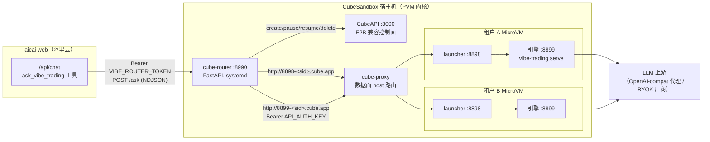
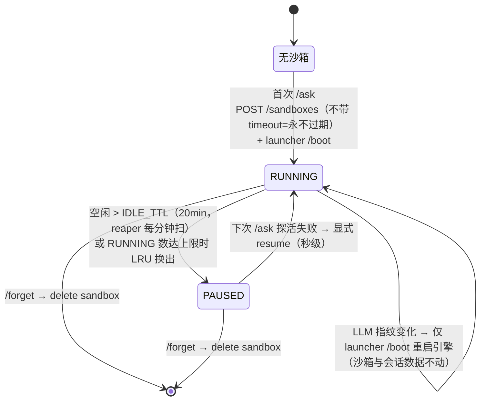
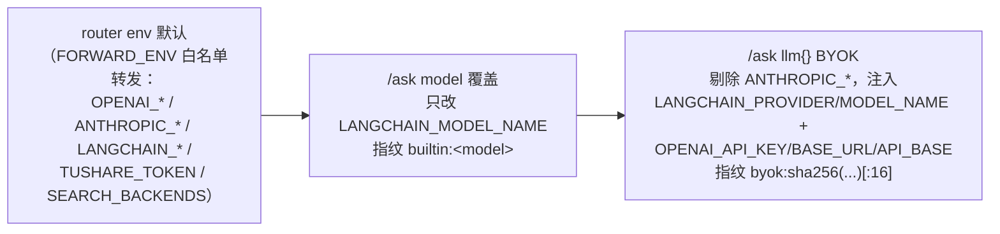

# PRODUCT_DESIGN — 多租户深度引擎架构与契约

本文描述本 fork 的多租户生产架构（`ops/cube-router` + `ops/cube-engine`）与全部对外契约。部署步骤见 [README_CUSTOM.md](README_CUSTOM.md)；方案演进与已退役的 v1 进程版见 [docs/HISTORY.md](docs/HISTORY.md)；引擎本体功能见[上游文档](https://github.com/HKUDS/Vibe-Trading)。

## 目录

1. [系统定位与拓扑](#1-系统定位与拓扑)
2. [多租户模型](#2-多租户模型)
3. [router 契约（对 laicai）](#3-router-契约对-laicai)
4. [launcher 协议（router → 沙箱）](#4-launcher-协议router--沙箱)
5. [LLM 配置链](#5-llm-配置链)
6. [资源与网络边界](#6-资源与网络边界)
7. [会话连续性](#7-会话连续性)
8. [与 laicai 的对接](#8-与-laicai-的对接)

## 1. 系统定位与拓扑

Vibe-Trading 上游是**单用户本地 agent**：所有落盘状态（长期记忆、会话历史、搜索索引、上传文件、券商凭据）从 `Path.home()` 或安装目录派生，进程内还有多处全局单例。laicai 要把它当多租户后端用，隔离边界取**每租户一台 KVM MicroVM 沙箱**：guest 独立内核、独立盘、独立 `HOME`，引擎的 shell 工具执行任意命令也只落在 guest 内。



组件职责：

| 组件 | 职责 |
|---|---|
| cube-router | 租户身份派生、沙箱生命周期编排、会话复用、LLM 配置注入、NDJSON 流式转发 |
| CubeAPI | 沙箱 create / pause / resume / delete（E2B 兼容 REST，`X-API-Key`） |
| cube-proxy | 数据面：`http://<port>-<sandboxID>.<SANDBOX_DOMAIN>` host 路由进 guest（宿主 split-DNS 解析 `*.cube.app` 到本机） |
| launcher | guest 内进程管理器：模板探针目标，按 router 下发的 env 拉起/重启引擎 |
| 引擎 | 上游 `vibe-trading serve`，全部业务能力（agent loop / 工具 / 回测 / 记忆） |

## 2. 多租户模型

### 2.1 租户身份

```
tenant_key = HMAC-SHA256(VIBE_ROUTER_SECRET, userId) → 64-hex
```

- 不可逆：原始 userId 不出现在任何路径、文件、日志中。
- **不变量：`VIBE_ROUTER_SECRET` 是 schema key，永不轮换**——它决定每个用户映射到哪个租户，轮换即令所有既有租户数据（沙箱、记忆、会话）全部孤立。

### 2.2 沙箱生命周期



- **懒建**：沙箱在租户第一次 `/ask` 时创建；创建必须走裸 CubeAPI 且不带 timeout（E2B SDK 默认 5 分钟 TTL 会杀沙箱）。
- **pause 保留盘 + 内存状态**，resume 秒级；数据面流量不会自动唤醒 paused 沙箱，router 在探活失败时显式 `POST /sandboxes/<id>/resume`。
- **防误杀**：每个在途 `/ask` 全程持有实例 `refcount`；reaper 与 LRU 换出都跳过 `refcount>0` 的实例；`last_activity` 在回答完成时更新。
- **防双开**：per-tenant `asyncio.Lock` 守护 get-or-create；同租户的并发首问阻塞等待复用同一沙箱。
- router 重启不影响沙箱：启动时从 state 文件重挂既有映射（沙箱已不存在则清理该行）。

### 2.3 隔离边界

三层，由外到内：

1. **MicroVM 硬边界**（v2 的核心增量）：guest 独立内核 + 独立 rootfs（模板镜像 + 4G writable layer）。shell 工具（`bash` / `background_run`）的任意命令执行落在 guest 内，宿主机不暴露；跨租户无共享文件系统、无共享进程空间。
2. **HOME 收口**：镜像内以用户 `vibe` 运行，`HOME=/home/vibe` → 长期记忆、搜索索引、oauth、shadow 账户、GoalStore 等一切 `Path.home()` 派生状态都在沙箱私有盘上，随 pause/resume 持久。
3. **引擎 env 档位**（router 经 `/boot` 注入每个租户引擎）：

| env | 作用 |
|---|---|
| `VIBE_DATA_DIR=/home/vibe/.vibe-trading` | `runs/` `sessions/` `uploads/`（原本派生自安装目录）统一重定向到租户数据根 |
| `VIBE_MULTITENANT=1` | fail-loud 标记：缺 `VIBE_DATA_DIR` 时引擎拒绝启动，杜绝静默写共享安装目录 |
| `VIBE_TRADING_TENANT_SAFE=1` | `build_registry` 排除**动钱红线**：`trading_*` 前缀全部工具 + `propose_mandate_profiles`。只读分析产品在任何配置下都不得触发真实下单/资金授权 |
| `VIBE_TRADING_ENABLE_SHELL_TOOLS=1` | 放开 shell 类工具（上游默认关）——任意命令执行已被 MicroVM 圈住，视为安全 |
| `API_AUTH_KEY=<随机>` | 引擎对非 loopback 调用方的 Bearer 鉴权 key，见 §5 |

`run_swarm` / `session_search` / `background_*` 不裁剪：其状态已被 HOME + 沙箱盘限定在本租户内（如 `session_search` 索引 = 本租户自己的 `~/.vibe-trading/sessions.db`，只搜本人跨线程历史）。

### 2.4 router 状态文件

`/var/lib/cube-router/state.json`（`VIBE_STATE_FILE`），原子写（tmp + replace）：

```json
{ "<tenant_key>": { "sandbox_id": "...", "llm_fp": "builtin:... | byok:<sha16> | null", "api_key": "<引擎 Bearer key>" } }
```

这是租户 → 沙箱映射的唯一持久化真源；router 重启靠它重挂沙箱不泄漏。删除某行 + 删沙箱 = 该租户彻底重置。

## 3. router 契约（对 laicai）

鉴权：所有端点要求 `Authorization: Bearer <VIBE_ROUTER_TOKEN>`，常量时间比较，无豁免（即使 loopback）。

### 3.1 `POST /ask` — 流式深度问答

请求体：

| 字段 | 类型 | 说明 |
|---|---|---|
| `uid` | string，必填 | laicai userId（router 内部立即 HMAC 成 tenant_key） |
| `query` | string，必填 | 用户问题（laicai 侧已注入真实持仓上下文） |
| `threadId` | string? | laicai 对话线程 id。协议兼容保留，当前 router 不使用（同租户请求已由实例锁串行化） |
| `vibeSessionId` | string? | 引擎会话 id；有值则续聊复用，缺省新建 |
| `model` | string? | 内置模型覆盖（如 `claude-sonnet-4-6`），白名单正则校验 |
| `llm` | object? | BYOK 覆盖：`{provider, model, apiKey, baseUrl}`，见 §5；与 `model` 互斥时以 `llm` 为准 |
| `timeoutS` | int? | 单问超时，默认 900 |

响应：`application/x-ndjson`，每行一帧：

```jsonc
{"t":"progress","ev":"<引擎 SSE 事件名>","data":<payload>}   // 0..n 帧，实时转发引擎
                                                            // /sessions/<sid>/events（replay=active）
{"t":"answer","answer":"<终答 markdown>","vibeSessionId":"<sid>"}   // 成功终帧
{"t":"error","status":<HTTP 语义码>,"detail":"..."}                  // 失败终帧
```

语义要点：

- **答案判定按 `attempt_id`**：router 发消息拿回本轮 `attempt_id`，轮询 `GET /sessions/<sid>/messages` 直到出现 `linked_attempt_id` 匹配且内容非空的 assistant 消息——复用会话时绝不会把上一轮答案当本轮返回。
- **会话失效自愈**：`vibeSessionId` 指向的会话在引擎侧 404（如沙箱曾被删除重建）→ router 透明新建会话、重发本问，终帧回传**新** `vibeSessionId`，laicai 应重绑线程。上下文丢失但长期记忆仍在（记忆在 HOME，不在 session）。
- 常见错误：401 未鉴权；400 model/llm 参数非法；503 实例忙（在途请求持有不同 LLM 指纹，或 RUNNING 沙箱满且无可换出者）；502 沙箱创建/引擎 boot 失败；504 引擎超时。
- 并发：全局同时处理的 `/ask` 数受 `VIBE_MAX_CONCURRENT_ACTIVE`（信号量）钳制，超出者排队等待。

### 3.2 `POST /forget` — 租户注销

`{"uid": "..."}` → 删除该租户沙箱（连同全部记忆/会话/上传）+ 清 state 行，幂等，返回 `{"ok": true}`。

### 3.3 `GET /healthz`

```jsonc
{
  "instances": 2, "running": 1, "active": 0, "max_running": 3,
  "tenants": [ {"tk8":"a1b2c3d4","sandbox":"sbx-...","paused":false,"refcount":0,"idle_s":42} ]
}
```

## 4. launcher 协议（router → 沙箱）

launcher（`ops/cube-engine/launcher.py`）是镜像的常驻进程与模板探针目标，监听 `:8898`；引擎 `:8899` 是它的子进程。一个模板即可服务所有租户与所有 LLM 配置——差异全部由 `/boot` 的 env 表达。

| 端点 | 语义 |
|---|---|
| `GET /health` | 200 `{"launcher":"ok","engine":"running"\|"starting"\|"stopped"}`。模板探针路径（`--probe 8898 --probe-path /health`）；router 也用它探活（失败 → resume 沙箱） |
| `POST /boot` `{"env":{...}}` | 杀现引擎（SIGTERM→SIGKILL）→ 以 `os.environ + env` spawn `vibe-trading serve --host 0.0.0.0 --port 8899` → 等引擎 `/health` 就绪（预算 `VIBE_LAUNCHER_BOOT_TIMEOUT`，默认 120s）。**幂等换配置的唯一入口** |
| `POST /stop` | 杀引擎进程 |

- 引擎绑 `0.0.0.0` 是刻意的：数据面经 cube-proxy 进来不是 loopback（guest 内也无外部暴露面——只有 cube-proxy 路由的端口可达）。
- **引擎重启语义**：router 对比实例当前 LLM 指纹与本次请求的目标指纹，不同且实例空闲 → 仅 `/boot`（进程级重启，沙箱、盘、会话文件全部不动）；实例在途（`refcount>0`）且指纹不同 → 503 让调用方稍后重试。

## 5. LLM 配置链

优先级从低到高：



- BYOK provider 映射（laicai 值 → 引擎 `LANGCHAIN_PROVIDER`）：`openai→openai`、`claude→openai`（走 api.anthropic.com/v1 的 OpenAI 兼容端点）、`gemini→gemini`、`deepseek→deepseek`、`kimi→kimi`、`glm→glm`。
- 入参校验：model 与 llm.model 过白名单正则（字母数字开头，≤100 字符）；`baseUrl` 须 `http(s)://` 且 ≤500 字符；`apiKey` 非空 ≤500 字符且无控制字符。BYOK apiKey 只进指纹哈希与引擎 env，不落日志。
- **指纹即实例身份**：引擎子进程的 env 启动后不可变（`build_llm` 虽每 attempt 读 env，读的也是引擎自己进程的 env），所以任何 LLM 配置切换都表现为 launcher `/boot` 重启引擎。
- **引擎侧鉴权**：经 cube-proxy 到达引擎的请求不是 loopback，引擎的 loopback 信任失效 → 引擎依赖 `API_AUTH_KEY` Bearer 校验。router 每次 boot 随机生成 32-hex key，注入引擎 env 并持久化到 state.json，之后对该实例的所有请求（sessions/messages/events）都带 `Authorization: Bearer <key>`。
- 引擎侧兼容性（本 fork 差异）：`opus-4-8`/`fable`/`mythos` 模型省略 `temperature`；流式默认请求 usage 块，`llm_usage` SSE 事件（增量 input/output tokens）经 progress 帧到达 laicai 做用量记账。

## 6. 资源与网络边界

**资源**：

| 项 | 值 | 说明 |
|---|---|---|
| 沙箱规格 | 2C / 2G（模板默认） | MicroVM 硬隔离，租户内 runaway 不外溢 |
| writable layer | 4G | 租户全部落盘状态（记忆/会话/上传/runs）的容量上限 |
| RUNNING 沙箱上限 | `VIBE_MAX_INSTANCES`（默认 3） | 8G 宿主机：OS + CubeSandbox 控制面 ≈2.5G，余量 ≈3 个 RUNNING；满则 pause LRU 空闲者，全忙 503 |
| 并发 `/ask` | `VIBE_MAX_CONCURRENT_ACTIVE`（默认 2） | 信号量排队 |
| 空闲 pause | `VIBE_IDLE_TTL_S`（默认 20min） | pause 不占 CPU/内存调度，盘保留 |
| router 自身 | systemd `MemoryMax=1G` | router 只做编排，不承载引擎负载 |

**网络边界**：

- 控制面：CubeAPI `:3000` 仅宿主机本地（router 同机调用，`X-API-Key`）。
- 数据面：cube-proxy host 路由 `http://<port>-<sandboxID>.<SANDBOX_DOMAIN>`，依赖宿主 split-DNS，仅宿主机内可解析——沙箱端口对外无直接暴露。
- 对外仅 `:8990`（cube-router）：Bearer token + 云安全组白名单（仅 laicai web 主机 IP）双闸。WebUI `:12088` 同样须安全组限源。
- 沙箱出网：当前全量放行（CubeEgress 白名单未启用）；风险面 = 沙箱内引擎的联网工具，比宿主机出网低一级，但可进一步收紧。

## 7. 会话连续性

两层机制，正交：

1. **线程内多轮**：laicai 在 `chat_threads.vibe_session_id` 持久化线程 ↔ 引擎会话的绑定；同线程追问带 `vibeSessionId`，router 直接 `POST /sessions/<sid>/messages` 续聊，引擎注入全量历史。复用会话的耗时远低于冷启（无重复推理铺垫）。历史注入有上限（`MAX_HISTORY_CHARS=12000`，裁旧轮次），超长线程靠长期记忆补位。
2. **跨会话长期记忆**：引擎的 `remember`/自动召回读写 `HOME/.vibe-trading/memory/`，在沙箱盘上跨线程、跨会话、跨 pause/resume、跨引擎重启持久；仅 `/forget`（删沙箱）清除。

失效路径见 §3.1 会话失效自愈：会话丢失只损失线程内上下文，长期记忆不受影响。

## 8. 与 laicai 的对接

laicai 侧的桥接实现（触发词门控、NDJSON 消费、进度事件透传、会话绑定、用量记账）见主仓库 `app/src/server/vibe-trading.ts` 与 laicai 侧文档，此处不复述。
