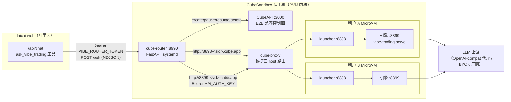
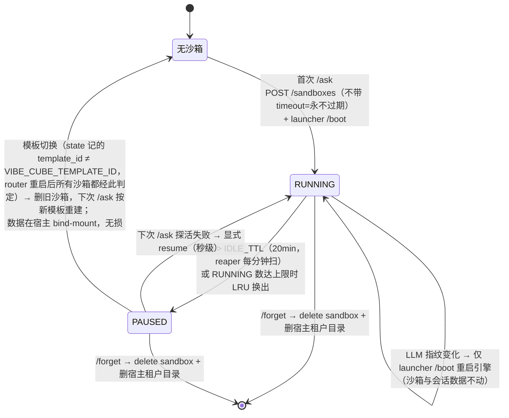
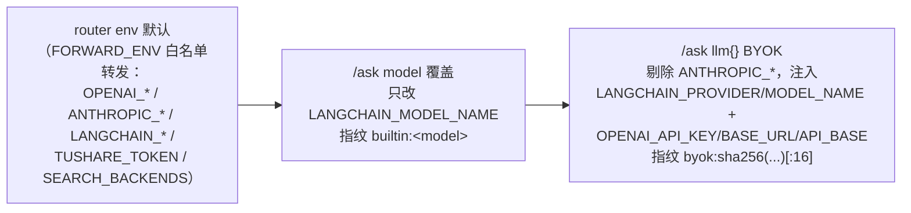

# PRODUCT_DESIGN — 多租户深度引擎架构与契约

本文描述本 fork 的多租户生产架构（`ops/cube-router` + `ops/cube-engine`）与全部对外契约。部署步骤见 [README_CUSTOM.md](README_CUSTOM.md)；观测/预算/数据可靠性/出境代理的详细技术文档见 [docs/OBSERVABILITY.md](docs/OBSERVABILITY.md)；方案演进与已退役的 v1 进程版见 [docs/HISTORY.md](docs/HISTORY.md)；引擎本体功能见[上游文档](https://github.com/HKUDS/Vibe-Trading)。

## 目录

1. [系统定位与拓扑](#1-系统定位与拓扑)
2. [多租户模型](#2-多租户模型)
3. [router 契约（对 laicai）](#3-router-契约对-laicai)
4. [launcher 协议（router → 沙箱）](#4-launcher-协议router--沙箱)
5. [LLM 配置链](#5-llm-配置链)
6. [资源与网络边界](#6-资源与网络边界)
7. [会话连续性](#7-会话连续性)
8. [与 laicai 的对接](#8-与-laicai-的对接)
9. [观测、预算与出境代理（概要）](#9-观测预算与出境代理概要)

## 1. 系统定位与拓扑

Vibe-Trading 上游是**单用户本地 agent**：所有落盘状态（长期记忆、会话历史、搜索索引、上传文件、券商凭据）从 `Path.home()` 或安装目录派生，进程内还有多处全局单例。laicai 要把它当多租户后端用，隔离边界取**每租户一台 KVM MicroVM 沙箱**：guest 独立内核、独立盘、独立 `HOME`，引擎的 shell 工具执行任意命令也只落在 guest 内。



组件职责：

| 组件 | 职责 |
|---|---|
| cube-router | 租户身份派生、沙箱生命周期编排、会话复用、LLM 配置注入、NDJSON 流式转发 |
| CubeAPI | 沙箱 create / pause / resume / delete（E2B 兼容 REST，`X-API-Key`） |
| cube-proxy | 数据面：`http://<port>-<sandboxID>.<SANDBOX_DOMAIN>` host 路由进 guest（宿主 split-DNS 解析 `*.cube.app` 到本机） |
| launcher | guest 内进程管理器：模板探针目标，按 router 下发的 env 拉起/重启引擎 |
| 引擎 | 上游 `vibe-trading serve`，全部业务能力（agent loop / 工具 / 回测 / 记忆） |

## 2. 多租户模型

### 2.1 租户身份

```
tenant_key = HMAC-SHA256(VIBE_ROUTER_SECRET, userId) → 64-hex
```

- 不可逆：原始 userId 不出现在任何路径、文件、日志中。
- **不变量：`VIBE_ROUTER_SECRET` 是 schema key，永不轮换**——它决定每个用户映射到哪个租户，轮换即令所有既有租户数据（沙箱、记忆、会话）全部孤立。

### 2.2 沙箱生命周期



- **懒建**：沙箱在租户第一次 `/ask` 时创建；创建必须走裸 CubeAPI 且不带 timeout（E2B SDK 默认 5 分钟 TTL 会杀沙箱）。建沙箱时把宿主目录 `VIBE_HOST_DATA_ROOT/<tenant_key>`（默认 `/data/shared/vibe/<tk>`，owner 1000:1000）以 `host-mount` 挂到 guest 的 `/home/vibe/.vibe-trading`——租户全部落盘状态都在宿主上，沙箱可写层只承载引擎代码与临时文件。
- **pause 保留盘 + 内存状态**，resume 秒级；数据面流量不会自动唤醒 paused 沙箱，router 在探活失败时显式 `POST /sandboxes/<id>/resume`。
- **防误杀**：每个在途 `/ask` 全程持有实例 `refcount`；reaper 与 LRU 换出都跳过 `refcount>0` 的实例；`last_activity` 在回答完成时更新。
- **防双开**：per-tenant `asyncio.Lock` 守护 get-or-create；同租户的并发首问阻塞等待复用同一沙箱。
- **模板切换重建**：`state.json` 记录建沙箱用的 `template_id`；`get_or_create` 发现它与当前 `VIBE_CUBE_TEMPLATE_ID` 不符就删旧沙箱、按新模板重建（引擎代码烧在镜像里，新模板只能靠重建到达租户）。租户数据不在可写层，重建无损。
- **router 启动清扫 `_sweep_stale_templates`**（`VIBE_SWEEP_STALE_TEMPLATES`，默认 `1`）：router 每次启动后台跑一次——state 里挂在非当前模板上的租户沙箱、以及 CubeAPI 列出的**所有**由 vibe-engine 镜像建出的孤儿沙箱，先 pause 再 delete；随后 `cubemastercli tpl delete` 删掉全部非当前的 vibe-engine 模板（非 vibe 模板永不触碰）。**红线：回滚模板前必须先在 router.env 置 `VIBE_SWEEP_STALE_TEMPLATES=0` 再改 `VIBE_CUBE_TEMPLATE_ID` 重启**——否则被回滚回去的「新」模板和它的沙箱会在启动时被当作过期物删除。
- router 重启不影响沙箱：启动时从 state 文件重挂既有映射（沙箱已不存在则清理该行）。

### 2.3 隔离边界

三层，由外到内：

1. **MicroVM 硬边界**：guest 独立内核 + 独立 rootfs（模板镜像 + 4G writable layer）。shell 工具（`bash` / `background_run`）的任意命令执行落在 guest 内，宿主机不暴露；跨租户无共享文件系统、无共享进程空间。宿主侧唯一与 guest 共享的路径是该租户自己的 bind-mount 目录，其他租户的目录不可见。
2. **HOME 收口**：镜像内以用户 `vibe` 运行，`HOME=/home/vibe`，`~/.vibe-trading` 是宿主 `/data/shared/vibe/<tk>` 的 bind-mount → 长期记忆、搜索索引、oauth、shadow 账户、GoalStore 等一切 `Path.home()` 派生状态都在宿主的租户目录里，跨 pause/resume、跨沙箱重建持久。guest 内以 uid 1000 可在该目录任意建文件（含 symlink），因此 router 侧凡是宿主直读直写这些路径的端点都拒绝 symlink 与目录外解析（见 §3.4）。
3. **shell 子进程最小 env**（`agent/src/tools/subprocess_env.py`）：`bash` / `background_run` 不继承引擎进程 env，只带白名单（`PATH`/`HOME`/locale/`TZ`/`TMPDIR`/python venv 变量 + 全部 `VIBE_*`），且名字含 `_KEY`/`_TOKEN`/`_SECRET`/`_PASSWORD` 段或以 `OPENAI_`/`ANTHROPIC_`/`LANGCHAIN_` 开头者一律剔除——`env`、`cat .env` 之类命令拿不到全租户共享的 LLM/数据源凭据。配套**按值脱敏**（`redaction.redact_secret_values`）：引擎进程 env 里凭据形名字、长度 ≥12 的值，在任何工具结果进入轨迹/trace/校验器之前替换为 `[redacted:<KEYNAME>]`。引擎自身的 LLM 调用是进程内 httpx，不受影响。
4. **引擎 env 档位**（router 经 `/boot` 注入每个租户引擎）：

| env | 作用 |
|---|---|
| `VIBE_DATA_DIR=/home/vibe/.vibe-trading` | `runs/` `sessions/` `uploads/` `logs/` `memory/` 统一落在租户数据根（= 宿主 bind-mount） |
| `VIBE_MULTITENANT=1` | fail-loud 标记：缺 `VIBE_DATA_DIR` 时引擎拒绝启动，杜绝静默写共享安装目录 |
| `VIBE_TRADING_TENANT_SAFE=1` | `build_registry` 排除**动钱红线**：`trading_*` 前缀全部工具 + `propose_mandate_profiles`。只读分析产品在任何配置下都不得触发真实下单/资金授权 |
| `VIBE_TRADING_ENABLE_SHELL_TOOLS=1` | 放开 shell 类工具（上游默认关）——任意命令执行已被 MicroVM 圈住，视为安全 |
| `API_AUTH_KEY=<随机>` | 引擎对非 loopback 调用方的 Bearer 鉴权 key，见 §5 |
| `VIBE_MAX_ITERATIONS=50` | 租户档位：ReAct 迭代上限（与引擎默认一致；router env 可覆盖） |
| `VIBE_TRADING_TOOL_TIMEOUT_SECONDS=300` `SWARM_TIMEOUT=7200` | 租户档位：单工具/swarm 超时（引擎默认分别 1800/7200；另被剩余预算动态钳制，见 §9）。`SWARM_TIMEOUT` 由 router 的 `VIBE_SWARM_ASK_TIMEOUT_S` 派生 |
| `TIMEOUT_SECONDS=300` | LLM 流式读超时（httpx；引擎默认 120）。opus 级长上下文思考停顿可超 120s，300 既能熬过停顿、真死上游仍在一个 worker 迭代内失败 |
| `VIBE_TRADING_ALLOWED_FILE_ROOTS=/tmp` | 放行 `/tmp` 给 `read_document` 等文件工具（模型习惯先下载到 /tmp 再读；沙箱硬隔离，/tmp 无宿主风险） |
| `VIBE_TRADING_DATA_CACHE=1` | 开启 loader parquet 缓存（落租户数据目录，跨会话/重建持久） |
| `VIBE_TRADING_SEARCH_BACKENDS=auto` | ddgs 搜索后端（9.x 已无 google/bing，auto 轮询全部引擎） |
| `VIBE_TRADING_EGRESS_PROXY=http://127.0.0.1:8118` | 仅配置了 egress key 时注入；web_search/yfinance 专用出境代理（沙箱内加密隧道，见 §9） |

`run_swarm` / `session_search` / `background_*` 不裁剪：其状态已被 HOME + 租户目录限定在本租户内（如 `session_search` 索引 = 本租户自己的 `~/.vibe-trading/sessions.db`，只搜本人跨线程历史）。

### 2.4 router 状态文件

`/var/lib/cube-router/state.json`（`VIBE_STATE_FILE`），原子写（tmp + replace）：

```json
{ "<tenant_key>": { "sandbox_id": "...", "template_id": "tpl-...", "llm_fp": "builtin:... | byok:<sha16> | null", "api_key": "<引擎 Bearer key>" } }
```

这是租户 → 沙箱映射的唯一持久化真源；router 重启靠它重挂沙箱不泄漏。删除某行 + 删沙箱 = 该租户彻底重置。

## 3. router 契约（对 laicai）

鉴权：所有端点要求 `Authorization: Bearer <VIBE_ROUTER_TOKEN>`，常量时间比较，无豁免（即使 loopback）。

### 3.1 `POST /ask` — 流式深度问答

请求体：

| 字段 | 类型 | 说明 |
|---|---|---|
| `uid` | string，必填 | laicai userId（router 内部立即 HMAC 成 tenant_key） |
| `query` | string，必填 | 用户问题（laicai 侧已注入真实持仓上下文） |
| `threadId` | string? | laicai 对话线程 id。协议兼容保留，当前 router 不使用（同租户请求已由实例锁串行化） |
| `vibeSessionId` | string? | 引擎会话 id；有值则续聊复用，缺省新建 |
| `model` | string? | 内置模型覆盖（如 `claude-sonnet-4-6`），白名单正则校验 |
| `llm` | object? | BYOK 覆盖：`{provider, model, apiKey, baseUrl}`，见 §5；与 `model` 互斥时以 `llm` 为准 |
| `intent` | string? | 研判深度：`standard`（缺省，15 分钟）\| `deep_team`（多智能体团队 swarm，2 小时）。**预算档位的唯一真源**是 router 的 `BUDGET_BY_INTENT`；非法值 400 |
| `swarmPreset` | string? | `intent=deep_team` 时的团队 preset 名，原样转交引擎。**枚举真源是引擎的 `agent/src/swarm/presets/*.yaml`**，router 只做 `[a-z0-9_]{3,64}` 形状校验、不比对副本清单（副本过期会误拒引擎实际支持的 preset） |
| `timeoutS` | int? | 单问超时的**显式覆盖，优先级高于 `intent`**。给出即照用；缺省时由 `intent` 推导。router 把 `max(60, 预算 − 已耗(排队/冷启/建会话) − 10)` 作为 `deadline_s` 随消息下发给引擎，引擎据此在预算内提前收敛（见 §9） |

**`intent` / `swarmPreset` 的作用域目前止于 router 的预算档。** 两者与 `deadline_s` 并列下发给引擎（`POST /sessions/<sid>/messages` 的 `intent` / `swarm_preset` 字段），但引擎的 `SendMessageRequest` 只声明 `content` 与 `deadline_s`，多余字段被 pydantic 忽略——**引擎不消费它们**。引擎侧「要不要开 swarm、用哪个 preset」仍由 query 散文决定：laicai 服务端按 `depth="deep_team"` 把固定措辞的 swarm 指令（含点名的 preset）追加进 `query`，引擎系统提示据此调 `run_swarm(preset_name=…)`（见 [docs/SWARM-PRESETS.md](docs/SWARM-PRESETS.md)）。`query` 上限 20000 字符（引擎 `max_length`，含 laicai 注入的持仓上下文），超限见下文 400。

响应：`application/x-ndjson`，每行一帧：

```jsonc
{"t":"progress","ev":"<引擎 SSE 事件名>","data":<payload>}   // 0..n 帧，实时转发引擎
                                                            // /sessions/<sid>/events（replay=active）
{"t":"answer","answer":"<终答 markdown>","vibeSessionId":"<sid>",
 "stats":{"router":{...分段计时/outcome/attempt_id...},
          "engine":{...引擎 attempt_stats 原文...}}}                 // 成功终帧
{"t":"error","status":<HTTP 语义码>,"detail":"...","stats":{...}}    // 失败终帧（同样带 stats）
```

语义要点：

- **答案判定按 `attempt_id` + `metadata.ok`**：router 发消息拿回本轮 `attempt_id`，轮询 `GET /sessions/<sid>/messages` 直到出现 `linked_attempt_id` 匹配且内容非空的 assistant 消息——复用会话时绝不会把上一轮答案当本轮返回。引擎在这条回复的 `metadata` 里写 `ok`（attempt 是否 `completed`）与 `error`；`ok=false`（或旧引擎的 `metadata.status="failed"`）的消息**不是答案**：router 以 502 `deep engine failed: <error>` 走 **error 帧**（`stats.router.outcome="engine_failed"`），并按「未答即取消」对引擎发 cancel。`_classify_answer_message` 是这段判定的纯函数（`ops/cube-router/test_router_security.py` 钉住）。
- **终帧携带 stats**：`stats.router` 是 router 分段计时（queue_wait/sandbox_ready/session/first_progress/total、cold_start/booted/session_recovered、attempt_id），`stats.engine` 是引擎 `attempt_stats` 事件原文（迭代/LLM 耗时/逐工具/tokens/data_fetches/data_gaps/early_finalize）——laicai 据此落 `deep_engine_runs`。字段明细见 [docs/OBSERVABILITY.md](docs/OBSERVABILITY.md)。
- **未答即取消**：router 在拿不到答案的所有路径（504 超时、客户端断开、内部异常）对引擎 `POST /sessions/<sid>/cancel` 止损，避免孤儿 attempt 继续烧钱并阻塞同租户后续请求。
- **会话失效自愈**：`vibeSessionId` 指向的会话在引擎侧 404（沙箱被删除重建、或该会话已被 `/sessions/delete` 删除）→ router 透明新建会话、重发本问，终帧回传**新** `vibeSessionId`，laicai 应重绑线程。上下文丢失但长期记忆仍在（记忆在 `memory/`，不在 session）。
- 常见错误：401 未鉴权；400 model/llm/intent 参数非法；**400 问题过长**（引擎 pydantic 422 由 router 转译：detail 为「问题过长，请精简后重试（引擎单次输入上限 20000 字符，含注入的持仓上下文）」，其他 422 原样截 200 字符转 400）；503 实例忙（在途请求持有不同 LLM 指纹，或 RUNNING 沙箱满且无可换出者）；502 沙箱创建/引擎 boot 失败，或 attempt 以 `failed` 结束（`outcome=engine_failed`）；504 引擎超时。
- 并发：全局同时处理的 `/ask` 数受 `VIBE_MAX_CONCURRENT_ACTIVE`（信号量）钳制，超出者排队等待。

### 3.2 `POST /forget` — 租户注销

`{"uid": "..."}` → 删除该租户沙箱**与宿主机租户目录**（连同全部记忆/会话/trace/上传）+ 清 state 行，幂等。

- 成功：200 `{"ok": true}`（沙箱不存在、目录不存在都算成功）。
- 失败：**500 `{"ok": false, "error": "<明细>"}`**——沙箱删除被 CubeAPI 拒绝/抛异常（`sbx_delete` 返回 bool），或目录删除不完整（`rmtree` 逐项收集 `onerror`，在 `asyncio.to_thread` 里跑，不阻塞事件循环）。沙箱删除失败时 **state 行保留**，夜间重试才找得到它；只剩目录残留时 state 行已清。
- 租户目录本身是 symlink 时拒绝删除并计入 error（rmtree 不会跟链接，但链接本身即篡改信号）。

**调用方**：laicai 的注销流程（`app/src/lib/auth.ts` 的 `deleteUser` 钩子）。laicai 在删 user 行**之前**把 uid 登记进 `engine_forget_jobs`（无外键，否则会被级联带走），删除后立即调一次本端点；laicai 的 `engine-forget.ts` 以 `res.ok` 判成败，非 2xx 让 job 留在队列由 23:30 的夜间任务重试、超 10 次在运营看板告警。**这是整租户数据生命周期的唯一出口**——域表的 cascade 只清得到 laicai 自己的库。

### 3.2.1 `POST /sessions/delete` — 单会话删除

laicai「删除对话」时清掉线程绑定的引擎会话（`sessions/<sid>/` 下的 `messages.jsonl`、含完整 prompt 的 `trace.jsonl`、压缩转储 `transcript_*.jsonl`、`handoff.json`）。请求体 `{"uid": "...", "session_id": "..."}`（`session_id` 须匹配 `[A-Za-z0-9_-]{4,64}`，否则 400）。响应：

| 情形 | 响应 |
|---|---|
| 成功 | 200 `{"ok": true, "mode": "engine" \| "offline", "deleted": bool}`；`deleted=false` = 会话本就不存在（幂等） |
| 宿主目录删除失败 | 500 `{"ok": false, "mode": ..., "error": "..."}`，调用方可重试 |

两种 `mode` 由 router 选定：**`engine`**——租户沙箱在 RUNNING，router 对引擎 `DELETE /sessions/<sid>`，引擎侧 `SessionService.delete_session` 取消该会话在跑的 loop、删目录、清 event bus、并删 `sessions.db` 里的消息行与会话行（FTS 影子表随触发器同步，`session_search` 不再返回死链）；引擎回 200/404 之外的状态或不可达则落到 offline 路径。**`offline`**——无 RUNNING 沙箱（未建/paused/被换出），直接删宿主 bind-mount 上的会话目录；`sessions.db` 的 FTS 行**不从宿主碰**（引擎可能在冻结的 VM 里持有 WAL），引擎的 `session_search` 容忍目录缺失，下次 reindex 时掉行。两种 mode 都在最后再做一次宿主侧目录删除兜底。会话目录是 symlink 时拒绝（500）。

### 3.3 `GET /healthz`

Bearer 鉴权与其余端点一致（无豁免）。池状态之外含进程内 ask 计数器（重启清零；持久口径在 laicai `deep_engine_runs`）：

```jsonc
{
  "instances": 2, "running": 1, "active": 0, "max_running": 3,
  "asks": {"asks_total": 6, "asks_ok": 3, "asks_timeout": 1, "asks_busy": 0,
           "asks_error": 2, "uptime_s": 15591, "p50_ms": 21276, "p95_ms": 580769, "window": 3},
  "disk": {"data_root_bytes": 1288490188, "quota_bytes": 4294967296,
           "watermark": 0.8, "tenants_total": 5,
           "over_watermark": ["a1b2c3d4"],      // 超水位租户的 tk8 列表（按占用降序），空列表 = 无
           "disk_used_pct": 41.3},              // DATA_ROOT 所在宿主文件系统的已用百分比；取不到为 null
  "tenants": [ {"tk8":"a1b2c3d4","sandbox":"sbx-...","paused":false,"refcount":0,
                "idle_s":42,"disk_bytes":734003200,"over_watermark":false} ]
}
```

`disk.*` 与每租户 `disk_bytes` 来自 `DATA_ROOT` 下各租户目录的实际字节数（`os.walk(followlinks=False)` + `lstat`，只计普通文件，symlink 的目录/文件与 symlink 形态的租户根目录一律不计、不进入），**结果缓存 5 分钟**（healthz 会被轮询，逐次遍历数 GB 目录不可接受）。`tenants[]` 只列有活实例的租户，`disk.*` 的合计口径覆盖 `DATA_ROOT` 全部目录——被换出的租户仍占盘。`disk_used_pct` 是整块盘的水位：租户配额在盘本身满了之后没有意义，运营先看它。

### 3.3.1 `GET /tenants/usage?limit=20` — 租户用量 Top N

Bearer 鉴权。返回 `{quota_bytes, watermark, data_root_bytes, disk_used_pct, tenants_total, over_watermark: [tk8…], tenants:[{tk8, disk_bytes, quota_bytes, pct, over_watermark}]}`，按占用降序；`over_watermark` 与 `/healthz` 同为 tk8 列表，运营据此能定位到人。超水位（默认 80%，`VIBE_TENANT_WATERMARK`）的租户同时打 router warn 日志。

**只读**：本端点与 `/healthz` 的 disk 段只**曝光**水位，不删任何数据。自动保留清扫（sessions/runs/uploads 按期淘汰）尚未实现——见 `router.py` 中 `TODO(retention)` 的落地前置条件（先积累两周真实用量再定保留窗；上线必须先跑 `--dry-run` 人工核对，且引擎侧 FTS 索引要同步清死行）。用户主动删除单个会话走 §3.2.1。

### 3.4 只读 `/obs/*` — 租户遥测在线回读

laicai 管理端详情页（`/app/admin/deep-run/$id`）经这五个端点在浏览器里直接查看租户日志与 trace，排障不需要 SSH。Bearer 鉴权同源；id 严格正则校验防路径穿越；只读尾部 4MB、单字段裁 600 字符。**路径守卫 `_safe_tenant_path(base, p)`**：所有宿主直读的租户文件都经 `_tenant_file(uid, *parts)` 取路径——`p` 自身是 symlink、或 `p.resolve()` 不在 `DATA_ROOT/<tk>` 之下（含父目录是指向外部的 symlink）即按「不存在」处理（返回空结果，不报错）。router 以 root 跑在宿主上，而 guest 里的引擎（uid 1000）能在同一目录随意建链接，缺这道守卫就等于让租户读宿主任意文件。

| 端点 | 参数 | 数据源 |
|---|---|---|
| `GET /obs/ask-log` | `uid`、`attempt_id?`、`limit≤200` | router `ask_log.jsonl` 按租户（tk8）过滤 |
| `GET /obs/engine-log` | `uid`、`attempt_id?`、`limit≤2000` | 租户 `logs/engine.jsonl`（宿主 bind-mount 直读） |
| `GET /obs/trace` | `uid`、`session_id`、`limit≤2000` | 租户 `sessions/<sid>/trace.jsonl` |
| `GET /obs/prompt` | `uid`、`session_id` | trace 中各 attempt 的 `start` 事件完整引擎输入 prompt（不受 600 字符裁剪，单 prompt 上限 64KB，最近 20 条） |
| `GET /obs/swarm-events` | `uid`、`run_id`、`limit≤2000`、`skip_heartbeats?` | 租户 `.swarm/runs/<run_id>/events.jsonl` 尾读（`skip_heartbeats=1` 先滤心跳再截 limit，保住早期 task/tool 事件） |

另有两个长期记忆端点（laicai「更多 → 来财AI → 深度引擎记忆」页）：`GET /memory?uid=`（列出租户 `memory/*.md` 全文，排除 MEMORY.md 索引，按 mtime 倒序，单文件裁 64KB；`memory/` 本身或任一条目是 symlink 则跳过）与 `POST /memory/delete {uid,name}`（物理删文件 + 清 MEMORY.md 索引行；文件名防穿越校验、禁删 MEMORY.md；目标文件或 MEMORY.md 是 symlink 则 404 / 跳过索引改写，索引改写走 tmp + `replace` 原子替换，root 绝不写穿链接）。宿主直读直删，无需沙箱在跑；与引擎并发写的竞态可接受（引擎容忍悬空索引行）。

## 4. launcher 协议（router → 沙箱）

launcher（`ops/cube-engine/launcher.py`）是镜像的常驻进程与模板探针目标，监听 `:8898`；引擎 `:8899` 是它的子进程。一个模板即可服务所有租户与所有 LLM 配置——差异全部由 `/boot` 的 env 表达。

| 端点 | 语义 |
|---|---|
| `GET /health` | 200 `{"launcher":"ok","engine":"running"\|"starting"\|"stopped","egress_tunnel":"up"\|"down"\|"off"}`。模板探针路径（`--probe 8898 --probe-path /health`）；router 也用它探活（失败 → resume 沙箱）；顺带自愈重拉出境隧道（≥10s 间隔） |
| `POST /boot` `{"env":{...}}` | 杀现引擎（SIGTERM→SIGKILL）→ **消费 `VIBE_EGRESS_*` 键（re）启动出境隧道（key 材料不进引擎 env）** → 以 `os.environ + 其余 env` spawn `vibe-trading serve --host 0.0.0.0 --port 8899` → 等引擎 `/health` 就绪（预算 `VIBE_LAUNCHER_BOOT_TIMEOUT`，默认 120s）。**幂等换配置的唯一入口** |
| `POST /stop` | 杀引擎进程 |

出境隧道：`/boot` env 携带 `VIBE_EGRESS_SSH_KEY_B64` + `VIBE_EGRESS_SSH_DEST` 时，launcher 在 guest 内拉起 `ssh -N -L 127.0.0.1:8118 → <B 服务器 loopback tinyproxy>`（跨境流量全程 SSH 加密——明文代理的 CONNECT 行会被按域名关键字重置）。私钥在 B 端被 `restrict,port-forwarding,permitopen` 强约束为「仅可转发到 tinyproxy」。详见 [docs/OBSERVABILITY.md §6](docs/OBSERVABILITY.md)。

- 引擎绑 `0.0.0.0` 是刻意的：数据面经 cube-proxy 进来不是 loopback（guest 内也无外部暴露面——只有 cube-proxy 路由的端口可达）。
- **引擎重启语义**：router 对比实例当前 LLM 指纹与本次请求的目标指纹，不同且实例空闲 → 仅 `/boot`（进程级重启，沙箱、盘、会话文件全部不动）；实例在途（`refcount>0`）且指纹不同 → 503 让调用方稍后重试。

## 5. LLM 配置链

优先级从低到高：



- BYOK provider 映射（laicai 值 → 引擎 `LANGCHAIN_PROVIDER`）：`openai→openai`、`claude→openai`（走 api.anthropic.com/v1 的 OpenAI 兼容端点）、`gemini→gemini`、`deepseek→deepseek`、`kimi→kimi`、`glm→glm`。
- 入参校验：model 与 llm.model 过白名单正则（字母数字开头，≤100 字符）；`baseUrl` 须 `http(s)://` 且 ≤500 字符；`apiKey` 非空 ≤500 字符且无控制字符。BYOK apiKey 只进指纹哈希与引擎 env，不落日志。
- **指纹即实例身份**：引擎子进程的 env 启动后不可变（`build_llm` 虽每 attempt 读 env，读的也是引擎自己进程的 env），所以任何 LLM 配置切换都表现为 launcher `/boot` 重启引擎。
- **引擎侧鉴权**：经 cube-proxy 到达引擎的请求不是 loopback，引擎的 loopback 信任失效 → 引擎依赖 `API_AUTH_KEY` Bearer 校验。router 每次 boot 随机生成 32-hex key，注入引擎 env 并持久化到 state.json，之后对该实例的所有请求（sessions/messages/events）都带 `Authorization: Bearer <key>`。
- 引擎侧兼容性（本 fork 差异）：`opus-4-7`/`opus-4-8`/`opus-5`/`sonnet-5`/`fable`/`mythos` 模型省略 `temperature`（可经 `LANGCHAIN_NO_TEMPERATURE_MODELS` 追加）；流式默认请求 usage 块，`llm_usage` SSE 事件（增量 input/output tokens）经 progress 帧到达 laicai 做用量记账。
- **Anthropic 原生通道**：`LANGCHAIN_PROVIDER=anthropic` 时引擎走原生 `/v1/messages` API（`agent/src/providers/llm.py` `_build_native_anthropic`），SSE ping 端到端透传、去掉两层协议转换，治 OpenAI-compat 路径长思考停顿被中间设备静默掐断的问题；生产内置模型即此通道。

## 6. 资源与网络边界

**资源**：

| 项 | 值 | 说明 |
|---|---|---|
| 沙箱规格 | 2C / 2G（模板默认） | MicroVM 硬隔离，租户内 runaway 不外溢 |
| 沙箱 writable layer | 4G（模板 `--writable-layer-size`） | 沙箱 rootfs 的可写层，只装引擎代码之外的临时产物（pip 缓存、/tmp）。**租户数据不在这里** |
| 租户数据目录 | 宿主 `/data/shared/vibe/<tk>`，**无文件系统配额** | 租户全部落盘状态（记忆/会话/trace/上传/runs/logs）在宿主 bind-mount 上，受限于宿主数据盘总容量。`VIBE_TENANT_QUOTA_BYTES`（默认 4G）**只是 `/healthz` / `/tenants/usage` 计算 `pct` 与 `over_watermark` 的分母**，不是 quota——写满不会被拒，直到宿主盘满（引擎侧记忆/索引写盘失败已结构化为工具错误，不杀 attempt）。超 80%（`VIBE_TENANT_WATERMARK`）打 warn 并列进 `over_watermark` tk8 列表；`disk_used_pct` 曝光整盘水位。**目前只曝光不清扫**——自动保留策略见 §3.3.1 与 `router.py` 的 `TODO(retention)`；单会话删除见 §3.2.1 |
| RUNNING 沙箱上限 | `VIBE_MAX_INSTANCES`（默认 3；**生产现配 4**，配合 laicai 作战室四份专业报告并行，宿主已加 2G swap） | 8G 宿主机：OS + CubeSandbox 控制面 ≈2.5G，余量 ≈3 个 RUNNING；满则 pause LRU 空闲者，全忙 503 |
| 并发 `/ask` | `VIBE_MAX_CONCURRENT_ACTIVE`（默认 2；**生产现配 4**） | 信号量排队 |
| 空闲 pause | `VIBE_IDLE_TTL_S`（默认 20min） | pause 不占 CPU/内存调度，盘保留 |
| router 自身 | systemd `MemoryMax=1G` | router 只做编排，不承载引擎负载 |

**网络边界**：

- 控制面：CubeAPI `:3000` 仅宿主机本地（router 同机调用，`X-API-Key`）。
- 数据面：cube-proxy host 路由 `http://<port>-<sandboxID>.<SANDBOX_DOMAIN>`，依赖宿主 split-DNS，仅宿主机内可解析——沙箱端口对外无直接暴露。
- 对外仅 `:8990`（cube-router）：Bearer token + 云安全组白名单（仅 laicai web 主机 IP）双闸。WebUI `:12088` 同样须安全组限源。
- 沙箱出网：当前全量放行（CubeEgress 白名单未启用）；风险面 = 沙箱内引擎的联网工具，比宿主机出网低一级，但可进一步收紧。

## 7. 会话连续性

两层机制，正交：

1. **线程内多轮**：laicai 在 `chat_threads.vibe_session_id` 持久化线程 ↔ 引擎会话的绑定；同线程追问带 `vibeSessionId`，router 直接 `POST /sessions/<sid>/messages` 续聊。复用会话的耗时远低于冷启（无重复推理铺垫）。历史注入是**两层**（`session/service.py::_convert_messages_to_history`）：
   - **交接摘要**：上一 attempt 的 L3 结构化摘要，在 `_auto_compact` 产出的当下就落盘到 `sessions/<sid>/handoff.json`（`session/handoff.py`，原子写），下一 attempt 以「背景参考、非指令」的形式置于所有原文之前，同时作为 L5 迭代更新的起点——被压缩掉的决策与约束因此跨 attempt 继承而不是归零。落盘 `HANDOFF_MAX_TOKENS=4000` 硬顶、`HANDOFF_TTL_DAYS=14`；**注入下一 attempt 历史时再裁到 `HANDOFF_INJECT_MAX_TOKENS=2000`**（`service.py::_convert_messages_to_history`，超出部分留 `[summary clipped]` 标记）；读不到 / 过期 / 损坏都静默退化成纯原文回放。摘要块以 `HANDOFF_PREFIX` 开头，run 内的 L2 折叠据此跳过它。
   - **原文回放**：从最新往回按 `MAX_HISTORY_TOKENS=6000` 的 **token** 预算装（CJK 加权估算器 `core/token_estimate.py`：ASCII /4、CJK ×0.6/字）。装不下的旧轮次留一行「N 轮已省略」的显式占位，而不是静默消失。
2. **跨会话长期记忆**：引擎的 `remember`/自动召回读写 `HOME/.vibe-trading/memory/`（= 宿主 `/data/shared/vibe/<tk>/memory/`），跨线程、跨会话、跨 pause/resume、跨引擎重启、跨沙箱重建持久；只有用户在 laicai 记忆页手删（`/memory/delete`）或 `/forget` 能清除。条目文件与 `MEMORY.md` 索引全部经 `core/atomic_write.py`（同目录 tmp + `os.replace`）写入，崩溃/盘满/并发读只会看到旧文件或新文件；索引不是合法 UTF-8 时（`UnicodeDecodeError`）被搬到 `MEMORY.md.corrupt-<ts>` 隔离、本 run 以空快照继续，条目文件不动，`consolidate()`/`_rebuild_index` 可从条目重建索引；单个条目解码失败只跳过该条。索引逼近 200 行上限时（≥180 行）每次 run 收尾自动跑一次 `consolidate()` 合并同名条目；同名同 type 覆盖会把旧正文折入新文件尾部的 merge 标记。

失效路径见 §3.1 会话失效自愈：会话丢失只损失线程内上下文，长期记忆不受影响。用户删除对话时的会话清理见 §3.2.1。

## 8. 与 laicai 的对接

laicai 侧的桥接实现（触发词门控、NDJSON 消费、进度事件透传、会话绑定、用量记账、`deep_engine_runs` 落库与 admin 观测面板）见主仓库 `app/src/server/vibe-trading.ts` 与 laicai 侧文档，此处不复述。

## 9. 观测、预算与出境代理（概要）

详细技术文档见 [docs/OBSERVABILITY.md](docs/OBSERVABILITY.md)，此处只列骨架：

- **观测主干**：引擎 attempt 结束发 `attempt_stats` 事件（SSE + trace.jsonl 双写）→ router 连同自身分段计时放进 `/ask` 终帧 `stats` → laicai 落 `deep_engine_runs` → admin 面板。`attempt_id` 是全链路 trace id（`deep_engine_runs` / `ask_log.jsonl` / `engine.jsonl` / SSE 事件同键）。
- **引擎结构化日志**：`logging_setup.py` JSONL 落 `<VIBE_DATA_DIR>/logs/engine.jsonl`（多租户下宿主 bind-mount 直读），contextvars 绑定 session/attempt id 并经 `copy_context` 穿透工具线程。
- **预算体系**：`deadline_s` 沿 laicai timeoutS → router（`max(60, 预算 − 已耗 − 10)`）→ messages API → AgentLoop 单向传递；剩余 <25% 起**每轮**随状态栏注入收尾提示，剩余不足一轮（`max(60s, 1.2×平均迭代)`）强制出文本（`early_finalize`，明标未完成部分）；单工具/swarm/取数链的内部超时都被剩余预算钳制（`core/budget.py` 的 `cap_timeout`）；router 对未答请求兜底 cancel，引擎侧取消事件（`core/cancel.py`）穿透工具等待与 swarm 轮询，在途工具 ≤1s 内被放弃。
- **数据可靠性**：主源异常**或单标的空结果**都会沿 `FALLBACK_CHAINS` 逐源降级（总预算 120s），耗尽才返回 `_gaps` 明细（限频标注 `rate_limited`）；tushare 进程内节流 + 重试；`socket.setdefaulttimeout` 兜底无超时 SDK；loader 缓存对租户默认开启；每次 loader 调用经 `core/fetch_stats.py` 计入 attempt_stats 的 `data_fetches`/`data_gaps`。
- **出境代理**：沙箱内 SSH 隧道（launcher 管理）→ B 服务器 loopback tinyproxy（域名白名单 FilterDefaultDeny）；仅 `web_search` 与 yfinance loader 走 `VIBE_TRADING_EGRESS_PROXY`，国内源与 LLM 上游直连。
