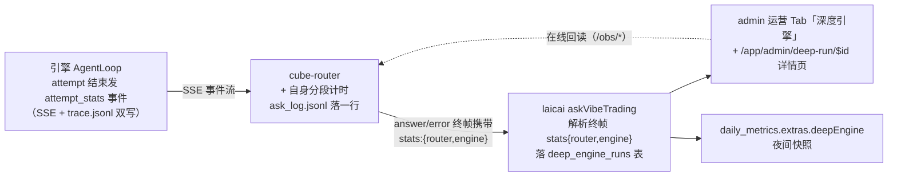
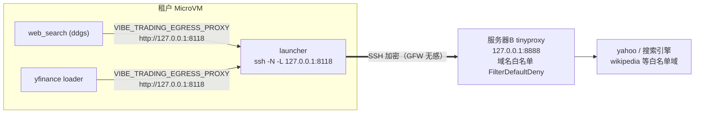

# OBSERVABILITY — 深度引擎观测、预算与数据可靠性

本文是引擎可观测性体系的**现状**技术文档：一次深度调用产生哪些遥测、落在哪、如何互相关联，以及预算（deadline）与数据可靠性（降级链/缺失上报/出境代理）如何工作。多租户架构与 HTTP 契约见 [PRODUCT_DESIGN.md](../PRODUCT_DESIGN.md)；部署 runbook 见 [README_CUSTOM.md](../README_CUSTOM.md)；方案演进见 [HISTORY.md](HISTORY.md)。

## 目录

1. [总览：一次调用的遥测流](#1-总览一次调用的遥测流)
2. [关联 id 体系](#2-关联-id-体系)
3. [引擎侧观测](#3-引擎侧观测)
4. [预算体系与提前收敛](#4-预算体系与提前收敛)
5. [数据可靠性](#5-数据可靠性)
6. [出境代理（白名单 egress）](#6-出境代理白名单-egress)
7. [router 侧观测](#7-router-侧观测)
8. [laicai 消费端](#8-laicai-消费端)
9. [环境变量参考](#9-环境变量参考)
10. [排障手册：按 attempt_id 五步追查](#10-排障手册按-attempt_id-五步追查)

## 1. 总览：一次调用的遥测流

指标主干**复用既有 NDJSON/SSE 通道**，全链路零新增基础设施：



持久化落点（按层）：

| 层 | 落点 | 内容 | 保留 |
|---|---|---|---|
| 引擎 | `<VIBE_DATA_DIR>/logs/engine.jsonl` | 结构化日志（JSONL，20MB×3 轮转） | 租户 bind-mount 盘，跨重建持久 |
| 引擎 | `<VIBE_DATA_DIR>/sessions/<sid>/trace.jsonl` | 逐事件 trace（含逐工具 `elapsed_ms` 与收口 `attempt_stats`） | 同上 |
| 引擎 | `<run_dir>/llm_usage.json` | 逐迭代 token 用量 | 同上 |
| router | `/var/lib/cube-router/ask_log.jsonl` | 每次 `/ask` 一行：分段计时 + outcome | 20MB 轮转（`.jsonl.1`） |
| router | 进程内计数器 | asks_total/ok/timeout/busy/error + 近 100 次成功 p50/p95 | 重启清零，`/healthz` 输出 |
| laicai | `deep_engine_runs` 表 | 每次调用一行（成功/失败/超时都写） | 永久 |
| laicai | `daily_metrics.extras.deepEngine` | 当日请求/成功/超时/冷启/P50/P95 | 永久（夜间快照） |

## 2. 关联 id 体系

**`attempt_id` 是全链路 trace id**，五处同键：

| 位置 | 字段 | 来源 |
|---|---|---|
| 引擎 SSE 每个事件的 data | `attempt_id` | `SessionService._run_with_agent` 的 `event_callback` 注入 |
| 引擎 `engine.jsonl` 每条日志 | `attempt_id` + `session_id` | contextvars（`logging_setup.bind_log_context`），经 `copy_context` 穿透工具线程 |
| 引擎 `trace.jsonl` | 无独立字段，按会话目录 + `iter` 定位 | attempt_stats/end 事件标记边界 |
| router `ask_log.jsonl` | `attempt_id` | `POST /sessions/<sid>/messages` 返回值 |
| laicai `deep_engine_runs` | `attempt_id` 列 | 终帧 `stats.router.attempt_id` |

线程传播机制：contextvars 不会自动进入线程池/新线程，所以三处显式用 `contextvars.copy_context()`：`service.py` 的两个 `run_in_executor` 调用、`loop.py` 的工具 worker 线程与并行工具池。每个 Context 只能同时 enter 一次，并行工具是**每个提交单独 copy**。

## 3. 引擎侧观测

### 3.1 结构化日志（`src/core/logging_setup.py`）

上游完全没有 logging 配置（INFO 直接被 root 的 lastResort 丢弃）。`setup_logging()` 在 api_server 的 startup hook 调用，幂等：

- **文件 sink**：`data_root()/logs/engine.jsonl`，`RotatingFileHandler` 20MB×3，JSONL 一行一条：`ts`(UTC ISO)/`level`/`logger`/`msg`/`session_id`/`attempt_id` + 所有 `extra=` 结构化字段 + 截断到 2000 字符的异常栈（`exc`）。多租户下该目录在宿主 `/data/shared/vibe/<tk>/logs/`，**宿主直读、无需进沙箱**。
- **stderr sink**：WARNING+ 纯文本，进 journald 兜底。
- 级别：`VIBE_LOG_LEVEL`（默认 INFO）。
- 数据链路（tushare/yfinance/okx loader）走 `logger.warning` + `source`/`symbol`/`error` 结构化字段；上游其余模块仍有 `print` 存量，不进 engine.jsonl。
- 工具结果在进入日志/trace/轨迹之前已经过按值脱敏（`redaction.redact_secret_values`）：引擎 env 里的凭据值出现在任何工具输出中都被替换为 `[redacted:<KEY>]`，所以 engine.jsonl / trace.jsonl 里不会有明文 key。

### 3.2 `attempt_stats` 事件

AgentLoop 在 **attempt 结束时**（成功/失败/取消/异常四条路径都发）emit 一帧汇总，同时写入 trace.jsonl：

```jsonc
{
  "status": "ok | failed | cancelled | error",
  "total_ms": 802778,
  "iterations": 20, "max_iterations": 25,
  "llm_calls": 20,          // 含 auto_compact 的额外调用
  "llm_ms": 601093,         // 全部 LLM 流式调用累计（含 compact）
  "compact_calls": 0,
  "tool_ms": 201476,        // 逐工具 elapsed_ms 之和
  "tokens": {"input": 102, "output": 38083, "total": 38185},   // 厂商实报
  "tools": [                // 按耗时降序
    {"name": "bash", "calls": 28, "ms": 103648, "errors": 2}
  ],
  "data_fetches": [         // 见 §5（fetch_stats 收集器）
    {"source": "tushare", "ok": 1, "failed": 0, "ms": 233, "fallback_used": 0}
  ],
  "data_gaps": [            // 全链耗尽仍缺数的标的
    {"symbol": "600519.SH", "reason": "rate_limited: …", "sources_tried": ["tushare","mootdx"]}
  ],
  "skills": [               // load_skill 调用记录（按耗时降序）
    {"name": "chanlun", "calls": 1, "ms": 12, "errors": 0}
  ],
  "swarm_runs": [           // run_swarm 调用记录（上限 20 条）
    {"preset": "investment_committee", "run_id": "…", "status": "completed",
     "ms": 231000, "agents": 4, "tasks": 4}
    // status ∈ completed/failed/cancelled/start_failed/error/
    //          wait_budget_exhausted（等待预算耗尽、run 仍在后台跑）/timeout/
    //          cancelled_wait（attempt 被取消、等待放弃，run 仍在后台且可用 run_id 续等）
  ],
  "early_finalize": false,  // 见 §4
  "model": "claude-opus-5",
  "reason": "…",            // 仅失败/取消时，截断 500 字符
  "verify_warnings": [...], // 可选：收口轻校验的警告（非空才出现）
  "compact_failures": 1,    // 可选：L3 摘要 LLM 调用失败次数（非零才出现）
  "offload_failures": 0     // 可选：工具结果落盘失败次数（非零才出现）
}
```

实现：`loop.py` 的 `self._stats` 累加器（llm 计时包住 `stream_chat` 含重试、`_finalize_tool_result` 累计工具、`_auto_compact` 计入 compact+llm），`_emit_attempt_stats()` 收口。事件名 `attempt_stats` 对下游是**新增事件**——消费方按「不认识的 ev 忽略」处理，新旧版本可交错部署。

### 3.3 trace.jsonl 增量

在上游既有类型（start/message/thinking/tool_call/tool_result/compact/end…）之上新增：

- `early_finalize`：`{iter, remaining_s, avg_iter_s}` —— deadline 驱动的强制收敛触发点；
- `attempt_stats`：同 §3.2 全量字段，方便离线只读 trace 即可拿到汇总；
- `tool_circuit_open`：`{iter, tool, consecutive_failures}` —— 同一 (工具, 参数) 连续失败达 `VIBE_TOOL_CIRCUIT_FAILURE_LIMIT`（默认 3）后该调用被拒。重复调用守卫只登记**成功**调用，所以这是「同一个坏调用烧掉多少迭代」的唯一信号；
- `empty_model_response_retry`：`{iter, attempt, max_retries, provider, model}` —— 流成功返回但既无 content 也无 tool_calls 时的就地重试（附一条 nudge，消耗一个正常迭代）。仍为空才写终态 `empty_model_response`；
- `compact_failed`：`{iter, error}` —— L3 摘要的 LLM 调用失败，本轮降级为只做 L1/L2 剪裁。**出现它不代表 attempt 失败**；`attempt_stats.compact_failures` 是它的计数；
- `memory_auto_consolidated`：`{duplicates_merged, entries, index_lines, index_full}` —— 索引 ≥180 行时 run 收尾自动跑的长期记忆整理；
- `tool_progress{stage:"cancelled"}` —— attempt 被取消时看门狗放弃等待在途工具的标记；对应的 `tool_result` 是 `{"status":"error","error_code":"cancelled"}` 结构化结果（`run_swarm` 的等待被取消时另带 `run_id` / `run_status`）。

既有事件的字段增量：

- `compact` 带 `input_messages_dropped` —— L3 摘要输入按 token 预算从**旧端**裁掉的消息条数；
- swarm 的 `tool_result` 事件 `status` 按 `_is_error_result` 判定，与主循环的 ok/error 双态口径一致；
- `attempt_stats` 的 `compact_failures` / `offload_failures` 只在非零时出现（落盘失败 = 盘满/只读时工具结果降级为带标记的纯截断）。

### 3.4 fetch_stats 收集器（`src/core/fetch_stats.py`）

attempt 级数据源记账。`loop.run()` 开头 `start_collect()` 绑一个**可变收集器对象**进 contextvar；工具线程经 copy_context 共享同一对象（内部加锁），所以任意线程里的 `record_fetch()/record_gap()` 都汇到本 attempt。未绑定时（CLI/回测/测试）模块级函数是 no-op，loader 不需要感知上下文。gaps 上限 100 条防病态膨胀。

### 3.5 budget（`src/core/budget.py`）

attempt 绝对 deadline（`time.monotonic()` 基准）的 contextvar + 三个工具函数：`bind_deadline` / `remaining_s` / `cap_timeout(requested, reserve_s, floor_s)`。同样经 copy_context 穿透线程，任何长耗时组件（工具超时、swarm 等待、market_data 降级链）都据此把自己的内部超时钳制到「真正剩余的时间」内。

### 3.6 cancel（`src/core/cancel.py`）

budget 的姊妹模块：`AgentLoop.run()` 开头把自己的 `threading.Event` 经 `bind_cancel_event` 绑进 contextvar，工具线程随 copy_context 继承。`sleep_unless_cancelled(seconds)` 是轮询循环里 `time.sleep` 的替代（事件一触发立即返回 True）；工具看门狗 `invoke_tool_guarded` 按 `CANCEL_POLL_S=1s` 切片等待 worker 队列，取消命中即返回 `error_code=cancelled` 的结构化结果而不是等工具自己回来。取消与 deadline 恰好同时到期时**取消优先**（最后一个切片里落地的 cancel 报 `cancelled`，不报成工具超时）。`run_swarm` 的等待循环用同一事件，取消时返回 `cancelled_wait`（run 保留在盘上，可用 `run_id` 续等）。会话层：`SessionService` 对同一会话的新 attempt 先 `cancel()` 仍在注册表里的旧 loop 再覆盖；`delete_session` 也先 cancel。

## 4. 预算体系与提前收敛

**原则：内层预算 = 外层剩余预算 × 折扣，永不倒挂。**

deadline 单向传递链：

```
laicai timeoutS（默认 900s）
  └► router /ask：engine_deadline_s = max(60, timeoutS − 已耗(排队/冷启/建会话) − 10)
       └► 引擎 POST /sessions/<sid>/messages 的 deadline_s 字段
            └► SessionService 换算绝对 deadline → budget.bind_deadline → AgentLoop.run(deadline=…)
```

循环内两级升级（`loop.py`）：

1. **收尾提示**（剩余 < 25% 总预算，**每轮**）：从跌破 25% 起，每次迭代都把 `[SYSTEM] Less than 25% of the time budget remains (~Ns)…` 并入该轮的 `<agent_status>` 状态栏（状态栏用后即弃，所以轨迹里始终只有一条），引导模型收敛、不再开新调查线。独立于「迭代数 80% 收尾提示」——后者按迭代计数，迭代慢时开火太晚。
2. **强制收敛 early_finalize**（剩余 < max(`VIBE_FINALIZE_RESERVE_S`=60s, 1.2×平均迭代耗时)）：本轮按「最后一轮」处理——丢弃工具定义强制出文本，并注入提示要求**基于已有材料立即作答、明确标注未完成/未验证部分**。trace/事件只在首次触发时写一次，提示行随状态栏持续到 run 结束。宁可给部分答案，不让调用方超时拿到空文案。

router 侧的 `max(60, …)` 下限意味着引擎拿到的 `deadline_s` 永远不少于 60s，哪怕调用方预算已在排队/冷启中耗尽——此时引擎立刻进入 early_finalize 分支，用这 60s 出一段部分答案。

配套钳制：

| 项 | 机制 |
|---|---|
| 单工具超时 | `_invoke_tool`：`cap_timeout(_tool_timeout(name), reserve=max(45s, VIBE_FINALIZE_RESERVE_S), floor=10s)`。base = `max(VIBE_TRADING_TOOL_TIMEOUT_SECONDS, tool.timeout_seconds)`——工具的声明只能放宽窗口不能收紧，且无论声明多少仍被 attempt 剩余预算钳制 |
| 写工具 1×/2× 窗口 | 只读工具超时即放弃；**写工具**（`is_readonly=False`）不可安全取消，故 1× 发 `tool_progress{stage:"timeout_warning"}` 继续等，2×（宽限段同样被钳制，floor=5s）仍未归才放弃：标 `degraded=true` + 回 `write_tool_timeout`。分母是上一行的 per-tool base，不是全局常量 |
| 声明了 `timeout_seconds` 的工具 | `run_swarm` = `SWARM_TIMEOUT + 120s`；`alpha_bench` = `VIBE_ALPHA_BENCH_BUDGET_S + 120s`；MCP 远端工具 = `tool_timeout + max(tool_timeout,30) + 30`。三者都**自带**预算并在耗尽时返回部分结果——只声明不自限等于把无界等待从循环挪进工具 |
| swarm 等待 | `swarm_tool`：`cap_timeout(SWARM_TIMEOUT, reserve=90s, floor=60s)`。**嵌套不变式：swarm 自留 90s > loop 自留 60s，所以工具必然先于看门狗自收口**——这是 `wait_budget_exhausted` 打捞路径（带回 `run_id` 与部分报告的唯一出口）能被执行的前提，回归测试见 `agent/tests/test_swarm_timeout_nesting.py` |
| bash 命令超时 | `VIBE_BASH_TIMEOUT_S`（默认 120s），同样被 attempt 剩余预算钳制（reserve 15s / floor 10s）；超时回 `bash_timeout` 并指向 `background_run` |
| market_data 总预算 | `min(VIBE_TRADING_FETCH_BUDGET_S=120, 剩余预算)`，见 §5 |
| 迭代上限 | `VIBE_MAX_ITERATIONS`（引擎默认 50 与上游一致；**router 给 laicai 租户同样下发 50**——swarm 意图的长任务仅数据收集阶段就要 ~20 迭代，墙钟 deadline 才是硬止损） |
| router 兜底取消 | `/ask` 未拿到答案（504/客户端断开/异常/attempt 以 failed 结束）一律 `POST /sessions/<sid>/cancel`，止住「超时后继续烧 + 拖死同租户重试」。引擎侧取消事件穿透在途工具等待与 swarm 轮询（§3.6），≤1s 内生效，不必等 30 分钟的工具自己回来 |
| 单次输入上限 | 引擎 `SendMessageRequest.content` 20000 字符（含 laicai 注入的持仓上下文）；超限的 422 由 router 转为 400「问题过长」 |

## 5. 数据可靠性

**原则：任何数据获取失败必须「有超时、有重试、有降级、有上报」。**

### 5.1 降级链（`src/market_data.py`）

`fetch_market_data` 两段式：

1. **主源 pass**：按请求源（或 `detect_source` 推断）整批取；整体异常记 ERROR 日志（含栈）并继续。
2. **降级 pass**：主源**异常或单标的空结果**都会让该标的沿 `FALLBACK_CHAINS[detect_market(code)]` 逐源重试（跳过已试源；降级尝试失败只记 WARNING）。总预算 `FETCH_BUDGET_S`（默认 120s，且被 attempt 剩余预算钳制），耗尽即停。

全链耗尽仍缺数的标的：保留 legacy `_unresolved` 键（向后兼容），并新增 `_gaps` 明细（`symbol`/`reason`/`sources_tried`，限频错误标注 `rate_limited:` 前缀）——**模型能明说缺什么，运营能统计缺失率**。每次 loader 调用都经 `fetch_stats.record_fetch` 计入 attempt_stats。

### 5.2 loader 层加固

| 项 | 机制 |
|---|---|
| tushare 节流 | 进程内间隔锁（`TUSHARE_MAX_PER_MIN`，默认 300/分）——全租户共享一个 token，防并发互相打限频 |
| tushare 重试 | daily 拉取 `retry_with_budget`（2 重试 / 30s 预算 / 退避 1s,3s） |
| 无超时 SDK 兜底 | api_server 启动设 `socket.setdefaulttimeout(VIBE_SOCKET_TIMEOUT_S=30)`——tushare/akshare/baostock 等阻塞 HTTP 不再无限挂（asyncio 非阻塞 socket 不受影响） |
| loader 缓存 | 上游既有 `VIBE_TRADING_DATA_CACHE`（parquet，只缓存已结算区间）；**router 对租户默认开启**，缓存落租户 bind-mount 盘跨会话持久。键是精确区间内容寻址，所以没有「预取暖缓存」——命中率趋零 |

### 5.3 `get_market_data` 载荷形状与截断

工具级契约（`src/market_data.py` + `src/tools/market_data_tool.py` + `src/agent/tool_result_store.py`）：

- **每标的紧凑表**：`{"summary": {start, end, rows, first_close, last_close, high, low, change_pct[, total_rows]}, "columns": [...], "rows": [[...], ...]}`——列名只出现一次，日线日期是裸 `YYYY-MM-DD`，数值 4 位小数（`PRICE_DECIMALS`）、整数值的浮点去 `.0`，NaN/inf → null；序列化不带缩进（`dumps_compact`）。被 `max_rows` 裁过的标的另带 `total_rows`/`returned`/`truncated`/`policy`/`hint`。`_unresolved` / `_gaps` 元数据键不变。`summary` 排在最前，是结构化截断时必定保留的部分。
- **默认 `max_rows=120`**（半个交易年的日线），一个标的的默认调用落在 10k 字符的轨迹预算之内（`TOOL_RESULT_LIMIT`），不再每次落盘。更长区间按等步长降采样（末根 bar 钉住），`truncated=true`；`max_rows=0` 取全量（必然落盘）。
- **参数 schema**：`source` 是 enum，`auto` + `backtest.loaders.registry.VALID_SOURCES` 里注册的全部 loader 名（动态取，registry 导入失败才回退到静态清单）；`interval` 是 enum `1m/5m/15m/30m/1H/4H/1D/1W/1M`（`1D` 全源支持，分钟/小时线 okx/ccxt/tushare/mootdx/futu/yfinance，周/月线 mootdx/futu/akshare）。
- **超 10k 的结构化预览**：不是盲切字符——每个标的保留 `summary` + 首尾各 20 根 bar（`MARKET_DATA_EDGE_ROWS`；多标的仍超限时收缩到首尾 5 根，再超才退回通用 head+tail 信封），`rows_omitted` 记中段丢弃数，预览本身是合法 JSON，并明说「中段 bar 不是数据源缺失」。全量落盘 `run_dir/tool-results/<iter>-get_market_data-<callid8>.json`，**每根 bar 一行**，`read_file(offset, limit)` 按行翻页即按 bar 翻页、`grep -n <日期>` 直接定位。
- 其他工具的单行 JSON 结果落盘前按 `indent=1` 重排成多行（否则 `read_file` 的行翻页永远只有一行）；`load_skill` 的落盘是 `.md` 原文（见 SKILLS.md §2）。信封里的翻页提示只指向 `read_file` 与 bash `grep -n`（引擎没有 `grep_file` 工具）。
- grounding 校验器（`verify.extract_reference_prices`）与结构化截断共用 `market_data.table_rows()` 读表，旧的 record 列表形状仍可解析。

## 6. 出境代理（白名单 egress）

阿里云北京沙箱出境被墙：web_search 的境外引擎直连 `ConnectError`、美股/雅虎数据退化。**明文 HTTP 代理直连境外不可行**——CONNECT 行明文过境会被按域名关键字重置（实测 duckduckgo 0.13s 秒断、未封锁的 yahoo 可通）。方案是把加密隧道端点放进沙箱：



- **launcher**（`ops/cube-engine/launcher.py`）：`/boot` env 携带 `VIBE_EGRESS_SSH_KEY_B64`/`VIBE_EGRESS_SSH_DEST` 时写 key（0600）并拉起隧道；key 材料被 launcher **pop 消费，不进引擎进程 env**。`/health` 顺带自愈重拉（≥10s 间隔）并上报 `egress_tunnel: up|down|off`。镜像含 `openssh-client`。
- **密钥约束**：B 端 `authorized_keys` 对该 key `restrict,port-forwarding,permitopen="127.0.0.1:8888"`——即使租户在沙箱内读到私钥，能获得的也只是白名单代理本身，无 shell、无其他转发。
- **B 端 tinyproxy**：仅监听 loopback；`Filter` + `FilterDefaultDeny` 域名白名单（yahoo/yimg、各搜索引擎、wikipedia/wikimedia、startpage、grokipedia）。**laicai market-data 的 md 隧道流量同受此白名单约束**——market-data 新增境外域时要同步加白名单。
- **使用方（这就是"白名单"的第二层）**：只有 `web_search`（DDGS 的 `proxy` 参数，兼容旧版 `proxies` 命名）和 `yfinance` loader（`yf.download(proxy=…)`，对删掉该参数的新版 TypeError 回退直连）读 `VIBE_TRADING_EGRESS_PROXY`。国内数据源（tushare/东财/腾讯/akshare/mootdx）与 LLM 上游**一律直连**——绝不能设全局 `HTTP(S)_PROXY`。
- **搜索后端**：ddgs 9.x 已移除 google/bing；默认 `VIBE_TRADING_SEARCH_BACKENDS=auto` 轮询其全部引擎（含 wikipedia/grokipedia 兜底）。数据中心出口 IP 被各引擎随机反爬属常态，空结果时模型会如实报告并转国内源。

## 7. router 侧观测

### 7.1 ask_log（`/var/lib/cube-router/ask_log.jsonl`）

每次 `/ask` 结束（无论结局）落一行：

| 字段 | 含义 |
|---|---|
| `ts` | 结束时刻（epoch 秒） |
| `tk8` | tenant_key 前 8 位（全量 key 不落日志） |
| `channel` / `model` / `timeout_s` | 请求参数 |
| `outcome` | `ok` / `timeout` / `busy` / `upstream_failed` / `engine_failed`（attempt 以 `failed` 结束，答案帧不发、走 error 帧 502）/ `error`（含 400 问题过长）/ `exception` / `incomplete`（客户端断开） |
| `intent` / `budget_source` | 结构化意图（`standard`/`deep_team`）与预算来源（`explicit` = 调用方给了 `timeoutS`，`intent` = 由意图推导） |
| `queue_wait_ms` | 全局并发信号量等待 |
| `cold_start` / `resumed` / `booted` | 沙箱路径标记 |
| `sandbox_ready_ms` / `session_ms` / `first_progress_ms` / `total_ms` | 分段计时 |
| `attempt_id` / `engine_status` / `iterations` / `engine_cancelled` | 引擎侧关联与结局 |
| `error` | 失败详情（截断 300 字符） |

同一份 stats 会随 answer/error 终帧的 `stats.router` 回传给 laicai。

### 7.2 healthz

`GET /healthz`（**Bearer 鉴权**，与其余端点一致）在池状态之外输出进程内计数器：

```jsonc
"asks": {"asks_total": 6, "asks_ok": 3, "asks_timeout": 1, "asks_busy": 0,
          "asks_error": 2, "uptime_s": 15591, "p50_ms": 21276, "p95_ms": 580769, "window": 3}
```

p50/p95 只统计成功请求（近 100 次环形窗口）；重启清零——持久口径以 laicai `deep_engine_runs` 为准。`disk` 段（`data_root_bytes` / `quota_bytes` / `watermark` / `tenants_total` / `over_watermark`（tk8 列表）/ `disk_used_pct`）与 `GET /tenants/usage` 的字段见 PRODUCT_DESIGN §3.3。

### 7.3 只读 `/obs/*` 端点（laicai 详情页在线回读）

五个端点，Bearer 鉴权同源，id 严格正则（`[A-Za-z0-9_-]{4,64}`）防路径穿越，路径经 `_tenant_file()` → `_safe_tenant_path()` 守卫（目标或其任一父级是 symlink、或解析后不在租户目录内 → 当作文件不存在返回空），只读尾部 4MB、单字段裁 600 字符、行数上限，文件读取走 `asyncio.to_thread`：

| 端点 | 参数 | 数据源 |
|---|---|---|
| `GET /obs/ask-log` | `uid`、`attempt_id?`、`limit≤200` | ask_log.jsonl 按 tk8（由 uid 派生）过滤 |
| `GET /obs/engine-log` | `uid`、`attempt_id?`、`limit≤2000` | 租户 `logs/engine.jsonl` |
| `GET /obs/trace` | `uid`、`session_id`、`limit≤2000` | 租户 `sessions/<sid>/trace.jsonl` |
| `GET /obs/prompt` | `uid`、`session_id` | trace 中各 attempt 的 `start` 事件完整引擎输入 prompt——`/obs/trace` 每字段裁 600 字符，此端点不裁（单 prompt 上限 64KB，最近 20 条），laicai trace 页的调用输入查看器用它 |
| `GET /obs/swarm-events` | `uid`、`run_id`、`limit≤2000`、`skip_heartbeats?` | 租户 `.swarm/runs/<run_id>/events.jsonl` 尾读（worker 工具调用/重试/心跳；`skip_heartbeats=1` 先滤心跳再截 limit，保住早期事件；`run_id` 来自 `attempt_stats.swarm_runs[].run_id`） |

## 8. laicai 消费端

laicai 侧实现在主仓库（桥接 `app/src/server/vibe-trading.ts`、落库 `deep-engine-runs.ts`、在线回读 `deep-run-debug.ts`、聚合 `ops-analytics.ts`），此处只列契约要点：

- `askVibeTrading` 解析终帧 `stats:{router,engine}` 并全路径计时/状态分类（`ok/timeout/busy/engine_error/router_unavailable/connection_failed/empty_answer/not_configured`），每次调用（含失败）落 `deep_engine_runs` 一行；token 列只记引擎 `llm_usage` 实报值（估算兜底只进 `ai_token_usage`，不污染测量口径）。
- admin 运营 Tab「深度引擎」Section：30 天请求/成功率/超时率/P50·P95/冷启占比/平均迭代/状态分布 + 最近 10 次明细表。
- 详情页 `/app/admin/deep-run/$id`：链路瀑布（排队/沙箱就绪/建会话/引擎执行/传输）、引擎内部 LLM vs 工具分解、逐工具耗时错误表、data_fetches/gaps 表、提前收敛徽标，以及经 `/obs/*` 的三个在线面板（Router 调用日志 / 引擎日志 / 执行 Trace）——**排障不需要 SSH**。

## 9. 环境变量参考

**引擎进程 env**（多租户下由 router `engine_env()` 经 launcher `/boot` 注入；括号内为 router 给 laicai 租户的下发值）：

| 变量 | 默认 | 说明 |
|---|---|---|
| `VIBE_LOG_LEVEL` | INFO | 结构化日志级别 |
| `VIBE_MAX_ITERATIONS` | 50（**50**） | ReAct 迭代上限 |
| `VIBE_FINALIZE_RESERVE_S` | 60 | 提前收敛的保底剩余秒数 |
| `VIBE_TRADING_TOOL_TIMEOUT_SECONDS` | 1800（**300**） | 单工具硬超时**默认值**（读写皆适用；写工具按 1× 警告 / 2× 放弃）。声明了 `timeout_seconds` 的工具取二者较大值，另被剩余预算钳制 |
| `SWARM_TIMEOUT` | 7200（**7200**） | swarm 等待上限（另被剩余预算钳制）。**租户档由 router 的 `VIBE_SWARM_ASK_TIMEOUT_S` 派生下发**，与 `intent=deep_team` 的 ask 预算同源——不要在 router.env 里单独写 `SWARM_TIMEOUT` 再让两者漂移。同时是 `run_swarm` 向循环声明的 `timeout_seconds` 来源（+120s 余量），要收紧 swarm 应改这里而不是调低租户档工具超时 |
| `VIBE_ALPHA_BENCH_BUDGET_S` | 1800 | alpha_bench 自身总预算；耗尽即停止起新 alpha 并返回部分 IC 表（`budget_exhausted`）。同时是它声明的 `timeout_seconds` 来源（+120s） |
| `VIBE_BASH_TIMEOUT_S` | 120 | bash 单命令超时（另被剩余预算钳制）；长任务应走 `background_run` |
| `VIBE_TOOL_CIRCUIT_FAILURE_LIMIT` | 3 | 同一 (工具, 参数) 连续失败几次后熔断该调用；命中写 `tool_circuit_open` |
| `VIBE_EMPTY_RESPONSE_RETRIES` | 1 | 流成功但返回空 turn 时的就地重试次数（0 = 一次即判败） |
| `TIMEOUT_SECONDS` | 120（**300**） | LLM 流式读超时（httpx）。opus 级长上下文的思考停顿可超 120s，300 能熬过停顿而真死的上游仍在一个 worker 迭代内失败 |
| `VIBE_TRADING_FETCH_BUDGET_S` | 120 | market_data 单次调用含降级链的总预算 |
| `VIBE_SOCKET_TIMEOUT_S` | 30 | 阻塞 socket 默认超时兜底 |
| `TUSHARE_MAX_PER_MIN` | 300 | tushare 进程内节流 |
| `VIBE_TRADING_DATA_CACHE` | off（**1**） | loader parquet 缓存 |
| `VIBE_TRADING_SEARCH_BACKENDS` | auto | ddgs 后端列表 |
| `VIBE_TRADING_ALLOWED_FILE_ROOTS` | 无（**/tmp**） | 文件工具在租户数据根之外额外放行的目录 |
| `VIBE_TRADING_EGRESS_PROXY` | 无（**http://127.0.0.1:8118**，配了 egress key 才注入） | web_search/yfinance 专用出境代理 |

以上变量中，凡名字带 `_KEY`/`_TOKEN`/`_SECRET`/`_PASSWORD` 段或 `OPENAI_`/`ANTHROPIC_`/`LANGCHAIN_` 前缀的都**不会**进入 `bash`/`background_run` 子进程；`VIBE_*` 全部透传（`src/tools/subprocess_env.py`）。

**launcher env**（`/boot` 时消费，不进引擎）：`VIBE_EGRESS_SSH_KEY_B64` / `VIBE_EGRESS_SSH_DEST` / `VIBE_EGRESS_REMOTE`(默认 127.0.0.1:8888) / `VIBE_EGRESS_LOCAL_PORT`(默认 8118)。

**router env 增量**（全量见 README_CUSTOM.md）：`VIBE_ASK_LOG`(默认 /var/lib/cube-router/ask_log.jsonl)、`VIBE_EGRESS_KEY_FILE`、`VIBE_EGRESS_SSH_DEST`、`VIBE_SWEEP_STALE_TEMPLATES`(默认 1，回滚模板前置 0)、`VIBE_CUBEMASTERCLI`，以及上表加粗值的同名覆盖项。

## 10. 排障手册：按 attempt_id 五步追查

首选路径：admin → 运营 Tab → 深度引擎 → 点最近明细任意一行——详情页已含瀑布图与三个在线日志面板，**通常到此为止**。需要下机器时：

```bash
# ① laicai 生产库拿 attempt_id / 会话 id
psql "$DATABASE_URL" -c "select created_at, attempt_id, vibe_session_id, status,
  total_ms/1000 as sec, iterations from deep_engine_runs order by id desc limit 10"

# ② 引擎机：router 分段计时（tk8 也在这一行里）
grep <attempt_id> /var/lib/cube-router/ask_log.jsonl

# ③ 租户引擎日志（宿主 bind-mount 直读）
TK=$(ls /data/shared/vibe/ | grep ^<tk8>)
grep <attempt_id> /data/shared/vibe/$TK/logs/engine.jsonl

# ④ 执行 trace（逐工具耗时 + attempt_stats 汇总）
less /data/shared/vibe/$TK/sessions/<vibe_session_id>/trace.jsonl

# ⑤ router 瞬时状态（在途/排队/池）
curl -s -H "Authorization: Bearer $TOKEN" http://127.0.0.1:8990/healthz | jq .
```

常见结论速查：`web_search` 大量 errors → 看 `/health` 的 `egress_tunnel` 与 B 端 tinyproxy；`data_gaps` 带 `rate_limited` → tushare 限频（节流器/积分档位）；`early_finalize=true` 高频 → 预算太紧或迭代太慢，对照瀑布图看时间去向；`outcome=incomplete` → 客户端（laicai）在终帧前断开，配合 `engine_cancelled` 确认止损生效；`outcome=engine_failed` → 引擎 attempt 自身失败（`error` 里是引擎的 `attempt.error`），去 trace 找 `end` 事件前的最后一个错误；`outcome=error` 且 detail 为「问题过长」→ laicai 注入的持仓上下文 + 问题超过 20000 字符；`/obs/*` 突然返回空而宿主上文件明明在 → 检查该路径或其父目录是否变成了 symlink（守卫按不存在处理）。
