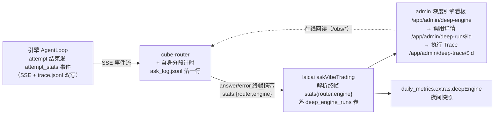
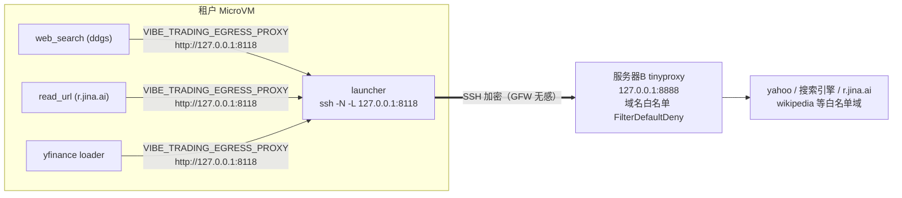

# OBSERVABILITY — 深度引擎观测、预算与数据可靠性

本文是引擎可观测性体系的**现状**技术文档：一次深度调用产生哪些遥测、落在哪、如何互相关联，以及预算（deadline）与数据可靠性（降级链/缺失上报/出境代理）如何工作。多租户架构与 HTTP 契约见 [PRODUCT_DESIGN.md](../PRODUCT_DESIGN.md)；部署 runbook 见 [README_CUSTOM.md](../README_CUSTOM.md)；方案演进见 [HISTORY.md](HISTORY.md)。

## 目录

1. [总览：一次调用的遥测流](#1-总览一次调用的遥测流)
2. [关联 id 体系](#2-关联-id-体系)
3. [引擎侧观测](#3-引擎侧观测)
4. [预算体系与提前收敛](#4-预算体系与提前收敛)
5. [数据可靠性](#5-数据可靠性)
6. [出境代理（白名单 egress）](#6-出境代理白名单-egress)
7. [router 侧观测](#7-router-侧观测)
8. [laicai 消费端](#8-laicai-消费端)
9. [环境变量参考](#9-环境变量参考)
10. [排障手册：按 attempt_id 五步追查](#10-排障手册按-attempt_id-五步追查)

## 1. 总览：一次调用的遥测流

指标主干**复用既有 NDJSON/SSE 通道**，全链路零新增基础设施：


```mermaid
flowchart LR
    E["引擎 AgentLoop<br/>attempt 结束发 attempt_stats 事件<br/>（SSE + trace.jsonl 双写）"]
    R["cube-router<br/>+ 自身分段计时<br/>ask_log.jsonl 落一行"]
    L["laicai askVibeTrading<br/>解析终帧 stats{router,engine}<br/>落 deep_engine_runs 表"]
    A["admin 深度引擎看板 /app/admin/deep-engine<br/>→ 调用详情 /app/admin/deep-run/$id<br/>→ 执行 Trace /app/admin/deep-trace/$id"]
    D["daily_metrics.extras.deepEngine<br/>夜间快照"]

    E -- "SSE 事件流" --> R
    R -- "answer/error 终帧携带<br/>stats:{router,engine}" --> L
    L --> A
    L --> D
    A -. "在线回读（/obs/*）" .-> R
```

持久化落点（按层）。引擎侧文件都在租户 bind-mount 上，一直保留到用户删除对话（会话目录、runs、swarm 产物随之删除）或注销（整个租户目录）；引擎侧的会话保留期清扫默认关闭（PRODUCT_DESIGN §3.3.1）：

| 层 | 落点 | 内容 | 保留 |
|---|---|---|---|
| 引擎 | `<VIBE_DATA_DIR>/logs/engine.jsonl` | 结构化日志（JSONL，20MB×3 轮转） | 租户 bind-mount 盘，跨重建持久 |
| 引擎 | `<VIBE_DATA_DIR>/sessions/<sid>/trace.jsonl` | 逐事件 trace（含逐工具 `elapsed_ms` 与收口 `attempt_stats`） | 同上 |
| 引擎 | `<run_dir>/llm_usage.json` | 逐迭代 token 用量 | 同上 |
| 引擎 | `<VIBE_DATA_DIR>/.swarm/runs/<id>/billed.json` | swarm run 已上报的 token 数（按 run 增量计费的账） | 同上，随 run 目录删除 |
| router | `/var/lib/cube-router/ask_log.jsonl` | 每次 `/ask` 一行：分段计时 + outcome | 20MB 轮转（`.jsonl.1`） |
| router | 进程内计数器 | asks_total/ok/timeout/busy/error + 近 100 次成功 p50/p95 | 重启清零，`/healthz` 输出 |
| laicai | `deep_engine_runs` 表 | 每次调用一行（成功/失败/超时都写） | 永久（`user_query` 列另有 laicai 侧保留期） |
| laicai | `daily_metrics.extras.deepEngine` | 当日请求/成功/超时/冷启/P50/P95 | 永久（夜间快照） |

## 2. 关联 id 体系

**`attempt_id` 是全链路 trace id**，五处同键：

| 位置 | 字段 | 来源 |
|---|---|---|
| router `/ask` 的 `attempt_meta` 帧 | `attempt_id` + `vibe_session_id` | router 拿到 `POST /sessions/<sid>/messages` 的返回后立即合成，先于任何引擎事件（PRODUCT_DESIGN §3.1） |
| 引擎 SSE 每个 attempt 级事件的 data | `attempt_id` | `SessionService._run_with_agent` 的 `event_callback` 注入；router 据此只转发本轮事件（`llm_usage` 的 `source=swarm_tail` 例外，§3.3） |
| 引擎 `engine.jsonl` 每条日志 | `attempt_id` + `session_id` | contextvars（`logging_setup.bind_log_context`），经 `copy_context` 穿透工具线程 |
| 引擎 `trace.jsonl` | 无独立字段，按会话目录 + `iter` 定位 | attempt_stats/end 事件标记边界；`start` 事件同样不带 attempt_id，`/obs/prompt` 的调用方按时间戳对上 attempt |
| router `ask_log.jsonl` | `attempt_id` | `POST /sessions/<sid>/messages` 返回值 |
| laicai `deep_engine_runs` | `attempt_id` 列 | 终帧 `stats.router.attempt_id` |

线程传播机制：contextvars 不会自动进入线程池/新线程，所以三个模块共六处显式用 `contextvars.copy_context()`：`session/service.py` 的两个 `run_in_executor` 调用（attempt 主体与取消/删除路径）、`agent/loop.py` 的工具 worker 线程（`invoke_tool_guarded`）与并行工具池（每次 `pool.submit`）、`swarm/runtime.py` 的 run 线程 spawn 与层内 executor 的每次 worker 提交（没有这两跳，swarm worker 里的 `fetch_stats` / skill 记账全是 no-op，`test_swarm_fetch_stats_propagation.py` 分别钉住）。每个 Context 只能同时 enter 一次，并行工具与 swarm worker 都是**每个提交单独 copy**。

## 3. 引擎侧观测

### 3.1 结构化日志（`src/core/logging_setup.py`）

上游完全没有 logging 配置（INFO 直接被 root 的 lastResort 丢弃）。`setup_logging()` 在 api_server 的 startup hook 调用，幂等：

- **文件 sink**：`data_root()/logs/engine.jsonl`，`RotatingFileHandler` 20MB×3，JSONL 一行一条：`ts`(UTC ISO)/`level`/`logger`/`msg`/`session_id`/`attempt_id` + 所有 `extra=` 结构化字段 + 截断到 2000 字符的异常栈（`exc`）。多租户下该目录在宿主 `/data/shared/vibe/<tk>/logs/`，**宿主直读、无需进沙箱**。
- **stderr sink**：WARNING+ 纯文本，进 journald 兜底。
- 级别：`VIBE_LOG_LEVEL`（默认 INFO）。
- 数据链路（tushare/yfinance/okx loader）走 `logger.warning` + `source`/`symbol`/`error` 结构化字段；上游其余模块仍有 `print` 存量，不进 engine.jsonl。
- 值得 grep 的几行：`swarm run finished after its attempt stopped waiting`（attempt 停止等待后仍在跑的 swarm run 结束，带尾段与总 token，见 §3.3）；`dotenv skipped (tenant profile)`（租户档不读 `.env`，启动一次）；`could not mark the engine process non-dumpable` / `prctl(PR_SET_DUMPABLE, 0) failed`（进程加固失败，只告警）。
- 工具结果在进入日志/trace/轨迹之前已经过按值脱敏（`redaction.redact_secret_values`）：引擎 env 里的凭据值出现在任何工具输出中都被替换为 `[redacted:<KEY>]`，出境隧道私钥（`~/.ssh/egress_key`，不在引擎 env 里）替换为 `[redacted:VIBE_EGRESS_SSH_KEY]`，所以 engine.jsonl / trace.jsonl 里不会有明文 key（按字符串匹配，模型换一种编码输出可以绕过）。

### 3.2 `attempt_stats` 事件

AgentLoop 在 **attempt 结束时**（成功/失败/取消/异常四条路径都发）emit 一帧汇总，同时写入 trace.jsonl：

```jsonc
{
  "status": "ok | failed | cancelled | error",
  "total_ms": 802778,
  "iterations": 20, "max_iterations": 25,
  "llm_calls": 20,          // 含 auto_compact 的额外调用
  "llm_ms": 601093,         // 全部 LLM 流式调用累计（含 compact）
  "compact_calls": 0,
  "tool_ms": 201476,        // 逐工具 elapsed_ms 之和
  "tokens": {"input": 102, "output": 38083, "total": 38185,     // 厂商实报
             "cache_read": 0, "cache_creation": 0},               // 可选，非零才出现；都包含在 input 之内
                                                                 // （cache_read / input = 缓存命中率）
  "tools": [                // 按耗时降序
    {"name": "bash", "calls": 28, "ms": 103648, "errors": 2}
  ],
  "data_fetches": [         // 见 §5（fetch_stats 收集器）
    {"source": "tushare", "ok": 1, "failed": 0, "ms": 233, "fallback_used": 0}
  ],
  "data_gaps": [            // 全链耗尽仍缺数的标的
    {"symbol": "600519.SH", "reason": "rate_limited: …", "sources_tried": ["tushare","mootdx"]}
  ],
  "skills": [               // load_skill 调用记录（按耗时降序）
    {"name": "chanlun", "calls": 1, "ms": 12, "errors": 0}
  ],
  "swarm_runs": [           // run_swarm 调用记录（上限 20 条）
    {"preset": "investment_committee", "run_id": "…", "status": "completed",
     "ms": 231000, "agents": 4, "tasks": 4}
    // status ∈ completed/failed/cancelled/start_failed/error/
    //          wait_budget_exhausted（等待预算耗尽、run 仍在后台跑）/timeout/
    //          cancelled_wait（attempt 被取消：等待放弃并对 run 发 cancel_run，run 进入 cancelled；只有 wait_budget_exhausted 才保留 run 供 run_id 续等）
  ],
  "early_finalize": false,  // 见 §4
  "degraded": false,        // 写工具超过 2× 硬超时被放弃（结果不可信，attempt 在部分基础上收尾）
  "model": "claude-opus-5",
  "reason": "…",            // 仅失败/取消时，截断 500 字符
  "verify_warnings": [...], // 可选：收口轻校验的警告（非空才出现）
  // 以下计数器都是可选、非零才出现：
  "compact_failures": 1,    // L3 摘要 LLM 调用失败或压缩前 transcript 写盘失败的次数
  "compact_skips": 1,       // 剩余不足两轮而跳过 L3 的次数（§4）
  "offload_failures": 0,    // 工具结果落盘失败次数
  "output_truncations": 1,  // finish_reason=length（输出被 max_tokens 截断）的轮数
  "truncated_tool_calls": 2, // 因截断而拒绝执行的工具调用个数
  "budget_truncated": true, // 可选：有一轮模型输出在 attempt deadline 处被截断（§4）
  "token_estimate_ratio": 1.37, // 可选：厂商实报 input_tokens ÷ 同一请求本地估算 的 EMA（测到才出现）
  "background_tasks": [    // 可选：本 attempt 起的后台任务（上限 20 条），status 取 attempt 结束时的现状
    {"task_id": "…", "command": "…", "status": "running | completed | …"}
  ],
  "stream_retries": {"main": 1, "swarm": 0, "swarm_llm_calls": 40}
                            // 可选：流重试次数（主循环 / swarm worker）与 swarm 侧 LLM 调用数；
                            // 流重试率 = (main + swarm) / (llm_calls + swarm_llm_calls)
}
```

实现：`loop.py` 的 `self._stats` 累加器（llm 计时包住 `stream_chat` 含重试、`_finalize_tool_result` 累计工具、`_auto_compact` 计入 compact+llm），`_emit_attempt_stats()` 收口；`data_fetches` / `data_gaps` / `skills` / `swarm_runs` / `background_tasks` / `stream_retries` 取自 §3.4 的 fetch_stats 收集器。消费方按「不认识的字段或 ev 忽略」处理，字段只增不改，新旧版本可交错部署。

`status` 与答案的关系：只有产出了非空正文的 attempt 才是 `ok`——回测留下的 `metrics.csv` 是产物不是答案，只有产物、没有正文（空回复、迭代耗尽）的 attempt 以真实原因失败；纯空白回复按空回复处理（先就地重试，仍为空则 `empty_model_response`）。会话层以同样口径写回执，router 与 laicai 看到的结局与 `attempt_stats.status` 一致。

### 3.3 trace.jsonl 增量

在上游既有类型（start/message/thinking/tool_call/tool_result/compact/end…）之上新增：

- `early_finalize`：`{iter, remaining_s, avg_iter_s}` —— deadline 驱动的强制收敛触发点；
- `forced_text_only`：`{iter, mode}` —— 收尾轮（最后一轮或 early_finalize）；`mode=tool_choice_none` 表示工具定义仍在请求里、以 `tool_choice=none` 禁止调用，`tools_omitted` 表示该 provider 不支持 `none`（`capabilities.tool_choice_none=False`）而退回省略 `tools`；
- `output_truncated`：`{iter, chars, has_tool_calls}` —— 该轮回复被输出 token 上限截断（`finish_reason=length` / `stop_reason=max_tokens`）；随后要么 `output_truncated_continue`：`{iter, attempt, max_continuations}`（截断正文留在轨迹、追加续写提示再跑一轮，占正常迭代），要么答案末尾带「（输出被截断）」标记（最后一轮或续写次数用尽）；同名 SSE 事件 `output_truncated`；swarm worker 侧对应 `worker_output_truncated`；
- `attempt_stats`：同 §3.2 全量字段，方便离线只读 trace 即可拿到汇总；
- `tool_circuit_open`：`{iter, tool, consecutive_failures}` —— 同一 (工具, 参数) 连续失败达 `VIBE_TOOL_CIRCUIT_FAILURE_LIMIT`（默认 3）后该调用被拒。重复调用守卫只登记**成功**调用，所以这是「同一个坏调用烧掉多少迭代」的唯一信号；
- `empty_model_response_retry`：`{iter, attempt, max_retries, provider, model}` —— 流成功返回但既无 content 也无 tool_calls 时的就地重试（附一条 nudge，消耗一个正常迭代）。仍为空才写终态 `empty_model_response`；
- `compact_failed`：`{iter, error}` —— L3 摘要的 LLM 调用失败，本轮降级为只做 L1/L2 剪裁。**出现它不代表 attempt 失败**；`attempt_stats.compact_failures` 是它的计数；
- `memory_auto_consolidated`：`{duplicates_merged, entries, index_lines, index_full}` —— 索引 ≥180 行时 run 收尾自动跑的长期记忆整理；
- `tool_progress{stage:"cancelled"}` —— attempt 被取消时看门狗放弃等待在途工具的标记；对应的 `tool_result` 是 `{"status":"error","error_code":"cancelled"}` 结构化结果（`run_swarm` 的等待被取消时另带 `run_id` / `run_status`）；
- `tool_calls_truncated`：`{iter, tools, attempt, max_continuations}` —— 被输出上限截断的那一轮带着工具调用：参数已被截坏，全部不执行，每个调用回 `tool_call_truncated` 结构化错误（提示拆小重发、长文用 `write_file` 的 `mode="append"` 分段写），计入续写次数；轨迹里保留 tool_use / tool_result 配对，超长字符串参数缩为首尾两段；
- `llm_deadline_cut`：`{iter, chars, discarded_tool_calls}` —— 模型输出流在 attempt deadline 处被截断：已流出的正文成为答案（末尾「（时间预算耗尽，输出被截断）」），部分工具调用丢弃不执行；
- `deadline_exhausted`：`{iter}` —— deadline 已过、不再开新一轮；此时没有任何答案则 attempt 以 `deadline_exhausted` 失败收口；
- `compact_skipped`：`{iter, reason, …}` —— `reason=budget`（剩余不足两轮，跳过 L3，带 `remaining_s`）或 `reason=context_small`（模型调 `compact` 时上下文不足阈值一半，带 `tokens`）；
- `goal_continuation_suppressed`：`{iter, goal_id, continuations, reason?|progress?}` —— 研究目标续跑被抑制：`reason=budget` 表示下一轮会越过收尾轮或预算（答案末尾附「研究目标尚未完成」），否则是次数用尽或没有新进展。

既有事件的字段增量：

- `compact` 带 `input_messages_dropped` —— L3 摘要输入按 token 预算从**旧端**裁掉的消息条数；
- swarm 的 `tool_result` 事件 `status` 按 `_is_error_result` 判定，与主循环的 ok/error 双态口径一致；
- `attempt_stats` 的 `compact_failures` / `offload_failures` 只在非零时出现（落盘失败 = 盘满/只读时工具结果降级为带标记的纯截断）；
- SSE `llm_usage`：增量 `input_tokens` / `output_tokens`，原生通道另带非零才出现的 `cache_read_tokens` / `cache_creation_tokens`（都包含在 `input_tokens` 之内，不能再相加）。swarm 用量带 `source="swarm"`、按 run 增量上报（`billed.json` 记已报数，续等到终态只报剩余）；attempt 停止等待后仍在跑的 run 由尾段计量线程盯到结束（最长 `SWARM_TIMEOUT + 600s`，run 被删即停），把剩余用量以 `source="swarm_tail"` 报一次——带的是上一轮的 `attempt_id`，router 放行并计入当时在流的 ask；run 结束时没有 ask 在流，这条事件只留在会话缓冲里、不会被后来那一轮的 attempt 窗口回放（它早于那一轮的锚点），这部分用量只记在 §3.1 那行引擎日志里；
- swarm worker 事件：`worker_output_truncated` 带 `tool_calls_refused`（被截断的工具调用同样不执行）；`worker_context_wrap_up`（上下文估算超过 60k 硬上限的 85%，注入一次收尾提示，此后只执行 `write_file` / `edit_file`，其余调用回 `context_budget_reached`）；`worker_token_limit` 与 `worker_completed{token_limit:true}`（到达硬上限时 `report.md` 已满足产出契约则按完成收口，否则 `status=token_limit`）；`worker_text` 按 0.5s 或 2000 字符批量发送，而不是每个 token 一条。

### 3.4 fetch_stats 收集器（`src/core/fetch_stats.py`）

attempt 级数据源记账。`loop.run()` 开头 `start_collect()` 绑一个**可变收集器对象**进 contextvar；工具线程经 copy_context 共享同一对象（内部加锁），所以任意线程里的 `record_fetch()/record_gap()` 都汇到本 attempt。未绑定时（CLI/回测/测试）模块级函数是 no-op，loader 不需要感知上下文。gaps 上限 100 条防病态膨胀。

### 3.5 budget（`src/core/budget.py`）

attempt 绝对 deadline（`time.monotonic()` 基准）的 contextvar + 三个工具函数：`bind_deadline` / `remaining_s` / `cap_timeout(requested, reserve_s, floor_s)`。同样经 copy_context 穿透线程，任何长耗时组件（工具超时、swarm 等待、market_data 降级链）都据此把自己的内部超时钳制到「真正剩余的时间」内。

### 3.6 cancel（`src/core/cancel.py`）

budget 的姊妹模块：`AgentLoop.run()` 开头把自己的 `threading.Event` 经 `bind_cancel_event` 绑进 contextvar，工具线程随 copy_context 继承。这枚令牌属于本 attempt，`run()` **不清零**它：在 run 开跑前就到达的取消（executor 排队、`build_registry` 期间）由第一个检查点直接转成 `cancelled` 终态。`run()` 退出时用 token 复位它绑定的 cancel 事件、deadline 与 fetch_stats 收集器三个 contextvar（事件本身仍不清零），同一线程里后跑的 attempt 或测试不会继承上一个的绑定。`sleep_unless_cancelled(seconds)` 是轮询循环里 `time.sleep` 的替代（事件一触发立即返回 True）；工具看门狗 `invoke_tool_guarded` 按 `CANCEL_POLL_S=1s` 切片等待 worker 队列，取消命中即返回 `error_code=cancelled` 的结构化结果而不是等工具自己回来。取消与 deadline 恰好同时到期时**取消优先**（最后一个切片里落地的 cancel 报 `cancelled`，不报成工具超时）。

`run_swarm` 的等待循环用同一事件，两种非终态出口刻意不同：**等待预算耗尽**返回 `wait_budget_exhausted`，run 不动、可用 `run_id` 续等；**attempt 级取消**（router 兜底、删会话、注销）返回 `cancelled_wait` 并调用 `cancel_run`——没有任何调用方会在 attempt 消失后续等一个 run。取消注册表是进程级的（`swarm/runtime.py` 以 run_id 建 `threading.Event`，工具每次调用新建的 `SwarmRuntime` 与 API 单例共用），并按会话登记在等的 run（`register_session_run`），所以 `SessionService.cancel_current` / `delete_session` 也能停掉已经 `wait_budget_exhausted` 交还、没人再等的 run（`cancel_session_runs`）。run 内部：`_execute_run` 在层边界检查，`run_worker` 在**每次迭代顶部**检查并把事件传给工具看门狗，`_run_worker_with_retries` 在**每次重试前**检查——被取消的 worker 以 `status=cancelled` 返回，任务记 `TaskStatus.cancelled`（事件 `task_cancelled`），run 终态 `cancelled`。

会话层：`SessionService` 对同一会话的新 attempt 先 `cancel()` 仍在注册表里的旧 loop 再覆盖；`delete_session` 也先 cancel。取消到达时 attempt 还在 `build_registry`（尚无 loop 可签）则记为 pending，loop 一注册立即投递；`POST /sessions/<sid>/cancel` 只有在「确实没有在途 attempt 也没有登记的 swarm run」时才回 `no_active_loop`。在途标记按 attempt 区分（会话 → attempt 集合），`cancel_current` 取消该会话所有在途 attempt，收尾时各自只清自己那一条。后台任务按会话归属，attempt 的取消事件置位或会话被删时按进程组杀掉；`bash` 也随 attempt 取消立即停止，回 `error_code=cancelled`。

### 3.7 事件流：回放范围与有损队列（`src/session/events.py`）

- 事件 id 为 `<epoch>-<seq>`：epoch 是每个引擎进程随机取的 8 位十六进制，seq 在同一进程内按发布顺序严格递增（跨会话共用一个计数器）。编号与投递订阅队列在同一把锁里完成，所以每个订阅者都按 id 顺序收到事件；订阅时的回放快照与登记队列也在同一把锁里，回放与实时部分不会重复。
- 每个会话一个事件缓冲（500 条）。`GET /sessions/<sid>/events?replay=active` 在会话最后一个 attempt 仍在跑时只回放**该 attempt** 的窗口：从它的 `attempt.created` 起，剔除带其他 `attempt_id` 的事件；锚点已被挤出缓冲时退化为按 `attempt_id` 过滤。两种情况都保留缓冲里的 `swarm_tail` 用量：窗口内的晚于锚点；锚点被挤出时，留在缓冲里的不可丢事件都晚于它。带 `Last-Event-ID` 重连时，本进程签发的 id 从它之后续传，即使该事件已被挤出缓冲；其他 id（上一个引擎进程的、附加转发帧的）在缓冲里找，找不到就回放整个 attempt 窗口。调用方按事件 id 去重：router 用高水位（PRODUCT_DESIGN §3.1「事件流断线续传」），上游前端按 id 集合。
- 可丢事件只有流式增量：`text_delta`、`tool_progress`、`elapsed_s`、`heartbeat` 与 `swarm.event(worker_text)`。订阅队列满时新来的可丢事件直接丢，新来的不可丢事件挤掉最旧的一条可丢事件，队列里全是不可丢事件时允许超过上限；缓冲超限时同样先淘汰可丢事件。`llm_usage`、`attempt_stats`、`attempt.*` 永不丢。

## 4. 预算体系与提前收敛

**原则：内层预算 = 外层剩余预算 × 折扣，永不倒挂。**

deadline 单向传递链：

```
laicai timeoutS（laicai 每次显式发：standard 900s / deep_team 7200s；不带时 router 按 intent 推导）
  └► router /ask：等答案窗口 = 请求到达 + timeoutS（排队、冷启、锁等待都在窗口里）
       engine_deadline_s = max(60, timeoutS − 已耗(排队/冷启/锁等待) − 10)，在建会话之前算出
       └► 引擎 POST /sessions/<sid>/messages 的 deadline_s 字段（缺省时租户档按 VIBE_DEFAULT_DEADLINE_S=900 兜底）
            └► SessionService 换算绝对 deadline → budget.bind_deadline → AgentLoop.run(deadline=…)
                 └► 每次模型调用 stream_chat(timeout=剩余) / 每次工具 cap_timeout(…)
```

循环内两级升级（`loop.py`）：

1. **收尾提示**（剩余 < 25% 总预算，**每轮**）：从跌破 25% 起，每次迭代都把 `[SYSTEM] Less than 25% of the time budget remains (~Ns)…` 并入该轮的 `<agent_status>` 状态栏（状态栏用后即弃，所以轨迹里始终只有一条），引导模型收敛、不再开新调查线。独立于「迭代数 80% 收尾提示」——后者按迭代计数，迭代慢时开火太晚。
2. **强制收敛 early_finalize**（剩余 < max(`VIBE_FINALIZE_RESERVE_S`=60s, 1.2×平均迭代耗时)）：本轮按「最后一轮」处理——工具定义保留、以 `tool_choice=none` 禁止调用来强制出文本，并注入提示要求**基于已有材料立即作答、明确标注未完成/未验证部分**。trace/事件只在首次触发时写一次，提示行随状态栏持续到 run 结束。宁可给部分答案，不让调用方超时拿到空文案。
3. **模型调用本身受 deadline 约束**：`stream_chat(timeout=…)` 是真正的墙钟预算——每收到一个 chunk 检查一次，到点就关流、返回已流出的部分（`LLMResponse.interrupted="deadline"`），到点之后的传输异常也按截断处理；同时经 `bind(timeout=…)` 收紧 SDK 的请求超时，只收紧、不放宽（基准 `TIMEOUT_SECONDS`）。主循环的取消检查同时看 cancel 与 deadline：被截断的那一轮，已流出的正文作为答案、末尾附「（时间预算耗尽，输出被截断）」（trace `llm_deadline_cut`、`attempt_stats.budget_truncated`），部分工具调用不执行；deadline 之后不再开新一轮（`deadline_exhausted`），此时仍没有任何答案则以 `deadline_exhausted` 失败收口。剩余风险：原生通道在完全没有 chunk 的静默期（首 token 前的预填充）不会轮询检查，思考过程持续流出 thinking delta 时每个 delta 都会触发检查。

router 侧的 `max(60, …)` 下限意味着引擎拿到的 `deadline_s` 永远不少于 60s，哪怕调用方预算已在排队/冷启中耗尽。注意 early_finalize 的判定从**第 2 轮**起才生效（`loop.py` 的 `iteration > 1`——需要先有一轮的平均耗时）：第 1 轮照常跑工具，只是工具窗被 `cap_timeout` 钳到 `_TOOL_CAP_FLOOR_S`=10s 地板；第 2 轮才强制收敛、用剩下的时间出一段部分答案。

配套钳制：

| 项 | 机制 |
|---|---|
| 单工具超时 | `_invoke_tool`：`cap_timeout(_tool_timeout(name), reserve=max(45s, VIBE_FINALIZE_RESERVE_S), floor=10s)`。base = `max(VIBE_TRADING_TOOL_TIMEOUT_SECONDS, tool.timeout_seconds)`——工具的声明只能放宽窗口不能收紧，且无论声明多少仍被 attempt 剩余预算钳制 |
| 写工具 1×/2× 窗口 | 只读工具超时即放弃；**写工具**（`is_readonly=False`）不可安全取消，故 1× 发 `tool_progress{stage:"timeout_warning"}` 继续等，2×（宽限段同样被钳制，floor=5s）仍未归才放弃：标 `degraded=true` + 回 `write_tool_timeout`。分母是上一行的 per-tool base，不是全局常量 |
| 声明了 `timeout_seconds` 的工具 | `run_swarm` = `SWARM_TIMEOUT + 120s`；`alpha_bench` = `VIBE_ALPHA_BENCH_BUDGET_S + 120s`；MCP 远端工具 = `tool_timeout + max(tool_timeout,30) + 30`。三者都**自带**预算并在耗尽时返回部分结果——只声明不自限等于把无界等待从循环挪进工具 |
| swarm 等待 | `swarm_tool`：`cap_timeout(SWARM_TIMEOUT, reserve=90s, floor=60s)`。**嵌套不变式：swarm 自留 90s > loop 自留 60s，所以工具必然先于看门狗自收口**——这是 `wait_budget_exhausted` 打捞路径（带回 `run_id` 与部分报告的唯一出口）能被执行的前提，回归测试见 `agent/tests/test_swarm_timeout_nesting.py` |
| bash 命令超时 | `VIBE_BASH_TIMEOUT_S`（默认 120s），同样被 attempt 剩余预算钳制（reserve 15s / floor 10s）；超时回 `bash_timeout` 并指向 `background_run` |
| market_data 总预算 | `min(VIBE_TRADING_FETCH_BUDGET_S=120, 剩余预算)`，见 §5 |
| 迭代上限 | `VIBE_MAX_ITERATIONS`（引擎默认 50 与上游一致；**router 给 laicai 租户同样下发 50**——swarm 意图的长任务仅数据收集阶段就要 ~20 迭代，墙钟 deadline 才是硬止损） |
| router 兜底取消 | `/ask` 未拿到答案（504/客户端断开/异常/attempt 以 failed 结束）一律 `POST /sessions/<sid>/cancel`，止住「超时后继续烧 + 拖死同租户重试」。引擎侧取消事件穿透在途工具等待与 swarm 轮询（§3.6），≤1s 内生效，不必等 30 分钟的工具自己回来；对 `intent=deep_team` 同样有效——swarm run 随 attempt 一起被 `cancel_run`，worker 在下一次迭代/重试前停下，不再跑完当前层。ask_log 的 `engine_cancelled` 只在引擎回 `status=cancelled` 时为 true，`engine_cancel_status` 记原始答复（`no_active_loop` / `http_<code>` / `unreachable`） |
| attempt 准备段失败 | 引擎在 loop 之外失败（`ChatLLM()` 凭据缺失、`build_registry`、run 目录/trace 文件写不进盘）也产出 `status=failed` 结果 + `attempt_stats{status:"error"}`，会话层写同形的 `ok=false` 回执并发 `attempt.failed`；router 在事件流上看到本 attempt 的 `attempt.failed` 即打断答案轮询，以 502 `engine_failed` 收尾而不是等满预算 |
| 单次输入上限 | 引擎 `SendMessageRequest.content` 20000 字符（含 laicai 注入的持仓上下文）；超限的 422 由 router 转为 400「问题过长」（error 帧 `code=query_too_long`） |
| L3 摘要 | 剩余不足两轮（`_round_reserve_s` 的两倍）时跳过（trace `compact_skipped{reason:"budget"}`、`attempt_stats.compact_skips`），轨迹保持原长——provider 窗口远大于压缩阈值；否则 `ChatLLM.summarize` 流式、按 chunk 可取消、客户端 `max_retries=0`，只能用「剩余 − 一轮保留量」的时间，摘要被截断按压缩失败降级（`compact_failed`） |
| goal 续跑 | 研究目标的续跑同样遵守收尾轮与预算：下一轮会越过最后一轮或预算放不下时不再续跑，答案末尾附「（研究目标尚未完成：本次时间预算不足以继续推进。）」（`goal_continuation_suppressed{reason:"budget"}`） |
| swarm worker | 每次 LLM 调用的超时真正生效（同一套流式截断）；被截断的调用与超出 worker 预算后的失败都按 `timeout` 收口，部分工具调用不执行；上下文估算到 60k 硬上限的 85% 时先收尾写报告（§3.3） |
| 等答案 | router 轮询答案的截止 = 请求到达 + timeoutS，所以带 stats 的 504 总早于 laicai 的 `timeoutS + 15s`；比引擎 deadline 晚约 10s，引擎先收口 |

## 5. 数据可靠性

**原则：任何数据获取失败必须「有超时、有重试、有降级、有上报」。**

### 5.1 降级链（`src/market_data.py`）

`fetch_market_data` 两段式：

1. **主源 pass**：按请求源（或 `detect_source` 推断）整批取；整体异常记 ERROR 日志（含栈）并继续。
2. **降级 pass**：主源**异常或单标的空结果**都会让该标的沿 `FALLBACK_CHAINS[detect_market(code)]` 逐源重试（跳过已试源；降级尝试失败只记 WARNING）。总预算 `FETCH_BUDGET_S`（默认 120s，且被 attempt 剩余预算钳制），耗尽即停。

全链耗尽仍缺数的标的：保留 legacy `_unresolved` 键（向后兼容），并新增 `_gaps` 明细（`symbol`/`reason`/`sources_tried`，限频错误标注 `rate_limited:` 前缀）——**模型能明说缺什么，运营能统计缺失率**。每次 loader 调用都经 `fetch_stats.record_fetch` 计入 attempt_stats。

### 5.2 loader 层加固

| 项 | 机制 |
|---|---|
| tushare 节流 | 进程内间隔锁（`TUSHARE_MAX_PER_MIN`，默认 300/分）——全租户共享一个 token，防并发互相打限频 |
| tushare 重试 | daily 拉取 `retry_with_budget`（2 重试 / 30s 预算 / 退避 1s,3s） |
| 无超时 SDK 兜底 | api_server 启动设 `socket.setdefaulttimeout(VIBE_SOCKET_TIMEOUT_S=30)`——tushare/akshare/baostock 等阻塞 HTTP 不再无限挂（asyncio 非阻塞 socket 不受影响） |
| loader 缓存 | 上游既有 `VIBE_TRADING_DATA_CACHE`（parquet，只缓存已结算区间）；**router 对租户默认开启**，缓存落租户 bind-mount 盘跨会话持久。键是精确区间内容寻址，所以没有「预取暖缓存」——命中率趋零 |

### 5.3 `get_market_data` 载荷形状与截断

工具级契约（`src/market_data.py` + `src/tools/market_data_tool.py` + `src/agent/tool_result_store.py`）：

- **每标的紧凑表**：`{"summary": {start, end, rows, first_close, last_close, high, low, change_pct[, total_rows]}, "columns": [...], "rows": [[...], ...]}`——列名只出现一次，日线日期是裸 `YYYY-MM-DD`，数值 4 位小数（`PRICE_DECIMALS`）、整数值的浮点去 `.0`，NaN/inf → null；序列化不带缩进（`dumps_compact`）。被 `max_rows` 裁过的标的另带 `total_rows`/`returned`/`truncated`/`policy`/`hint`。`_unresolved` / `_gaps` 元数据键不变。`summary` 排在最前，是结构化截断时必定保留的部分；它的首末收盘、涨跌、高低点按降采样**之前**的整个请求区间计算（`summary.rows` 仍是实际返回的行数，`total_rows` 不变），真实高低点落在未采样的 bar 上也不会丢。`change_pct` 是百分数，与 `get_realtime_quotes.change_pct` 同单位（TickFlow 原始值是小数，工具内乘 100）。
- **默认 `max_rows=120`**（半个交易年的日线），一个标的的默认调用落在 10k 字符的轨迹预算之内（`TOOL_RESULT_LIMIT`），不再每次落盘。更长区间按等步长降采样（末根 bar 钉住），`truncated=true`；`max_rows=0` 取全量（必然落盘）。
- **参数 schema**：`source` 是 enum，`auto` + `backtest.loaders.registry.VALID_SOURCES` 里注册的全部 loader 名（动态取，registry 导入失败才回退到静态清单）；`interval` 是 enum `1m/5m/15m/30m/1H/4H/1D/1W/1M`（`1D` 全源支持，分钟/小时线 okx/ccxt/tushare/mootdx/futu/yfinance，周/月线 mootdx/futu/akshare）。
- **超 10k 的结构化预览**：不是盲切字符——每个标的保留 `summary` + 首尾各 20 根 bar（`MARKET_DATA_EDGE_ROWS`；多标的仍超限时收缩到首尾 5 根，再超才退回通用 head+tail 信封），`rows_omitted` 记中段丢弃数，预览本身是合法 JSON，并明说「中段 bar 不是数据源缺失」。全量落盘 `run_dir/tool-results/<iter>-get_market_data-<callid8>.json`，**每根 bar 一行**，`read_file(offset, limit)` 按行翻页即按 bar 翻页、`grep -n <日期>` 直接定位。
- 其他工具的单行 JSON 结果落盘前按 `indent=1` 重排成多行（否则 `read_file` 的行翻页永远只有一行）；`load_skill` 的落盘是 `.md` 原文（见 SKILLS.md §2）；`bash` 的落盘是纯文本流（stdout，stderr 接在 `--- stderr ---` 行之后，文件名 `<iter>-bash-<callid>.txt`），工具本身整段返回、不再另裁另存（只剩每路流 100 万字符的流式硬上限：超过即杀进程组、保留前缀并标记，`output_capped` 字段列出命中的流）；`read_file` 默认一页 200 行，超限结果只做 head+tail 预览、**不落盘副本**，预览指回源文件的 offset/limit。信封里的翻页提示只指向 `read_file` 与 bash `grep -n`（引擎没有 `grep_file` 工具）。
- grounding 校验器（`verify.extract_reference_prices`）与结构化截断共用 `market_data.table_rows()` 读表，旧的 record 列表形状仍可解析。

## 6. 出境代理（白名单 egress）

阿里云北京沙箱出境被墙：web_search 的境外引擎直连 `ConnectError`、美股/雅虎数据退化。**明文 HTTP 代理直连境外不可行**——CONNECT 行明文过境会被按域名关键字重置（实测 duckduckgo 0.13s 秒断、未封锁的 yahoo 可通）。方案是把加密隧道端点放进沙箱（沙箱网络策略对全部 RFC1918 `denyOut`，guest 够不到宿主上的端点，见 PRODUCT_DESIGN §6）：


```mermaid
flowchart LR
    subgraph guest["租户 MicroVM"]
        L["launcher<br/>ssh -N -L 127.0.0.1:8118"]
        WS["web_search (ddgs)"]
        RU["read_url (r.jina.ai)"]
        YF["yfinance loader"]
    end
    B["服务器B tinyproxy<br/>127.0.0.1:8888<br/>域名白名单 FilterDefaultDeny"]
    NET["yahoo / 搜索引擎 / r.jina.ai<br/>wikipedia 等白名单域"]

    WS & RU & YF -- "VIBE_TRADING_EGRESS_PROXY<br/>http://127.0.0.1:8118" --> L
    L == "SSH 加密（GFW 无感）" ==> B
    B --> NET
```

- **launcher**（`ops/cube-engine/launcher.py`）：`/boot` env 携带 `VIBE_EGRESS_SSH_KEY_B64`/`VIBE_EGRESS_SSH_DEST` 时写 key（0600）并拉起隧道；key 材料被 launcher **pop 消费，不进引擎进程 env**。`/health` 顺带自愈重拉（≥10s 间隔）并上报 `egress_tunnel: up|down|off`。镜像含 `openssh-client`。
- **密钥约束**：B 端 `authorized_keys` 对该 key `restrict,port-forwarding,permitopen="127.0.0.1:8888"`——即使租户在沙箱内读到私钥，能获得的也只是白名单代理本身，无 shell、无其他转发。
- **B 端 tinyproxy**：仅监听 loopback；`Filter` + `FilterDefaultDeny` 域名白名单，须放行的域按消费方分三组：yahoo/yimg（yfinance）、各搜索引擎 + wikipedia/wikimedia + startpage + grokipedia（web_search）、**`r.jina.ai`（read_url）**。**laicai market-data 的 md 隧道流量同受此白名单约束**——market-data 新增境外域时要同步加白名单。
- **使用方（这就是"白名单"的第二层）**：三个消费方读 `VIBE_TRADING_EGRESS_PROXY`——`web_search`（DDGS 的 `proxy` 参数，兼容旧版 `proxies` 命名）、`read_url`（`tools/web_reader_tool.py`，`requests.get(..., proxies=…)` 访问 `r.jina.ai`，连接 5s / 读 30s；不设代理时直连）和 `yfinance` loader（`yf.download(proxy=…)`，对删掉该参数的新版 TypeError 回退直连）。国内数据源（tushare/东财/腾讯/akshare/mootdx）与 LLM 上游**一律直连**——绝不能设全局 `HTTP(S)_PROXY`。
- **搜索后端**：ddgs 9.x 已移除 google/bing；默认 `VIBE_TRADING_SEARCH_BACKENDS=auto` 轮询其全部引擎（含 wikipedia/grokipedia 兜底）。数据中心出口 IP 被各引擎随机反爬属常态，空结果时模型会如实报告并转国内源。

## 7. router 侧观测

### 7.1 ask_log（`/var/lib/cube-router/ask_log.jsonl`）

每次 `/ask` 结束（无论结局）落一行：

| 字段 | 含义 |
|---|---|
| `ts` | 结束时刻（epoch 秒） |
| `tk8` | tenant_key 前 8 位（全量 key 不落日志） |
| `channel` / `model` / `timeout_s` | 请求参数 |
| `outcome` | `ok` / `timeout` / `busy` / `upstream_failed` / `engine_failed`（attempt 以 `failed` 结束，答案帧不发、走 error 帧 502）/ `forgotten`（租户墓碑期内的 ask，410）/ `error`（含 400 问题过长）/ `exception` / `incomplete`（客户端断开） |
| `intent` / `budget_source` | 结构化意图（`standard`/`deep_team`）与预算来源（`explicit` = 调用方给了 `timeoutS`，`intent` = 由意图推导） |
| `queue_wait_ms` | 全局并发信号量等待（等到与没等到都记；没等到时 `outcome=busy`、`busy_reason=active_queue_full`） |
| `busy_reason` | 仅 503 时：`active_queue_full` / `instances_full` / `model_switch` |
| `cold_start` / `resumed` / `booted` / `boot_adopted` | 沙箱路径标记；`boot_adopted` = 上次没拿到 200 的 `/boot` 其实已生效、经鉴权探测直接采纳 |
| `lock_wait_ms` | 同租户上一问还在跑时，在租户锁上的等待 |
| `sandbox_ready_ms` / `session_ms` / `first_progress_ms` / `total_ms` | 分段计时（`first_progress_ms` 只看放行的非心跳事件） |
| `engine_deadline_s` | 下发给引擎的 `deadline_s` |
| `session_recovered` / `auth_reboot` | 会话在引擎侧 404 后透明新建 / 引擎 401 后以新 key 重启一次再重试 |
| `poll_errors` / `pump_reconnects` / `stale_events_dropped` | 失败的答案轮询次数 / 事件流重连次数 / 因不属于本轮 attempt 而丢弃的事件数（都只在非零时出现） |
| `attempt_id` / `engine_status` / `iterations` | 引擎侧关联与结局 |
| `engine_cancelled` / `engine_cancel_status` | 未答路径的兜底 cancel：前者仅在引擎确认（`cancelled`）时为 true，后者是引擎对 cancel 的原始答复（`cancelled` / `no_active_loop` / `http_<code>` / `unreachable`）；这一行日志由 cancel 任务在拿到答复后写出 |
| `error` | 失败详情（截断 300 字符） |

同一份 stats 会随 answer/error 终帧的 `stats.router` 回传给 laicai。

### 7.2 healthz

`GET /healthz`（**Bearer 鉴权**，与其余端点一致）在池状态之外输出进程内计数器：

```jsonc
"asks": {"asks_total": 6, "asks_ok": 3, "asks_timeout": 1, "asks_busy": 0,
          "asks_error": 2, "uptime_s": 15591, "p50_ms": 21276, "p95_ms": 580769, "window": 3}
```

顶层与每个 `tenants[]` 另有 `booting`（正在冷启 / 重挂 / resume 的实例，已计入 `running`）。p50/p95 只统计成功请求（近 100 次环形窗口）；重启清零——持久口径以 laicai `deep_engine_runs` 为准。`disk` 段（`data_root_bytes` / `quota_bytes` / `watermark` / `tenants_total` / `over_watermark`（tk8 列表）/ `disk_used_pct`）与 `GET /tenants/usage` 的字段见 PRODUCT_DESIGN §3.3。

### 7.3 只读 `/obs/*` 端点（在线回读）

五个端点，Bearer 鉴权同源，id 严格正则（`[A-Za-z0-9_-]{4,64}`）防路径穿越，路径经 `_tenant_file()` → `_safe_tenant_path()` 守卫（目标自身是 symlink，或 `resolve()` 之后不在租户目录内——包括父目录是指向外部的 symlink——当作文件不存在返回空；父目录的 symlink 解析后仍在租户目录内则放行），只读尾部 4MB、单字段裁 600 字符、行数上限，文件读取走 `asyncio.to_thread`：

| 端点 | 参数 | 数据源 |
|---|---|---|
| `GET /obs/ask-log` | `uid`、`attempt_id?`、`limit≤200` | ask_log.jsonl 按 tk8（由 uid 派生）过滤 |
| `GET /obs/engine-log` | `uid`、`attempt_id?`、`limit≤2000` | 租户 `logs/engine.jsonl` |
| `GET /obs/trace` | `uid`、`session_id`、`limit≤2000` | 租户 `sessions/<sid>/trace.jsonl` |
| `GET /obs/prompt` | `uid`、`session_id` | trace 中各 attempt 的 `start` 事件完整引擎输入 prompt——`/obs/trace` 每字段裁 600 字符，此端点不裁（单 prompt 上限 64KB，最近 20 条），laicai 执行 Trace 页的调用输入查看器用它 |
| `GET /obs/swarm-events` | `uid`、`run_id`、`limit≤2000`、`skip_heartbeats?` | 租户 `.swarm/runs/<run_id>/events.jsonl` 尾读（worker 工具调用/重试/心跳；`skip_heartbeats=1` 先滤心跳再截 limit，保住早期事件；`run_id` 来自 `attempt_stats.swarm_runs[].run_id`） |

laicai 目前只在执行 Trace 页（`/app/admin/deep-trace/$id`）用 `/obs/trace`、`/obs/swarm-events`、`/obs/prompt`；`/obs/ask-log` 与 `/obs/engine-log` 没有页面在用，排障时 curl（`?uid=<laicai userId>&attempt_id=<id>`）或直接读宿主文件。router 的 access log 把查询参数里的 `uid` 改写成 `tk8:<8位>`，原始 userId 不进 journald。

## 8. laicai 消费端

laicai 侧实现在主仓库（桥接 `app/src/server/vibe-trading.ts`、落库 `deep-engine-runs.ts`、在线回读 `deep-run-debug.ts`、聚合 `ops-analytics.ts`），此处只列契约要点：

- `askVibeTrading` 解析终帧 `stats:{router,engine}` 并全路径计时/状态分类（`ok/timeout/busy/engine_error/router_unavailable/connection_failed/empty_answer/not_configured`），每次调用（含失败）落 `deep_engine_runs` 一行；token 列只记引擎 `llm_usage` 实报值（估算兜底只进 `ai_token_usage`，不污染测量口径）。
- `attempt_meta` 帧一到就给 `status=running` 的占位行补上 attempt_id 与会话 id，并以它为本轮 attempt 的归属锚点；laicai 在 router 之外再按 `data.attempt_id` 做一道过滤（第二道防线）。**这道过滤必须对 `llm_usage` 的 `source="swarm_tail"` 开例外**（它带的是上一轮的 attempt_id，router 有意放行，见 §3.3），否则 swarm 尾段的 token 不进用户用量。
- error 帧：`code=query_too_long` / `query_rejected` 是可处置的拒绝，转述 detail、不说「稍后重试」；`code=busy`（带 `busy_reason`）对应 503；`code=tenant_forgotten`（410）表示账号已注销，不应重试、也不当作引擎故障告警。
- 深度引擎看板 `/app/admin/deep-engine`：30 天请求/成功率/超时率/P50·P95/冷启占比/平均迭代/状态分布 + 分页明细。
- 调用详情页 `/app/admin/deep-run/$id`（只读 laicai 的 `deep_engine_runs`）：链路瀑布（排队/沙箱就绪/建会话/引擎执行/传输）、引擎内部 LLM vs 工具分解、逐工具耗时错误表、data_fetches/gaps 表、提前收敛徽标。
- 执行 Trace 页 `/app/admin/deep-trace/$id`：经 `/obs/trace`、`/obs/swarm-events`、`/obs/prompt` 在线读租户 trace、swarm 事件（甘特图）与完整输入 prompt，运行中即可看——大多数排障不需要 SSH；router 调用日志与引擎日志见 §7.3。

## 9. 环境变量参考

**引擎进程 env**。多租户下引擎 env = 镜像 `ENV` + router `engine_env()` 经 launcher `/boot` 下发的部分。router 能送进引擎的只有三类：档位默认值（在 router.env 设同名变量即覆盖）、`FORWARD_ENV` 显式名单、`LANGCHAIN_*` / `VIBE_ANTHROPIC_*` 前缀（减去 LangSmith 拒绝名单）。所以下面分两张表：

**router 可覆盖**（括号内加粗为 router 给 laicai 租户的下发值；改 router.env 后各租户在下一次 `/ask` 重启一次引擎生效）：

| 变量 | 默认 | 说明 |
|---|---|---|
| `VIBE_MAX_ITERATIONS` | 50（**50**） | ReAct 迭代上限。档位默认值 |
| `VIBE_TRADING_TOOL_TIMEOUT_SECONDS` | 1800（**300**） | 单工具硬超时**默认值**（读写皆适用；写工具按 1× 警告 / 2× 放弃）。声明了 `timeout_seconds` 的工具取二者较大值，另被剩余预算钳制。档位默认值 |
| `SWARM_TIMEOUT` | 7200（**7200**） | swarm 等待上限（另被剩余预算钳制）。**租户档由 router 的 `VIBE_SWARM_ASK_TIMEOUT_S` 派生下发**，与 router 按 `intent=deep_team` 推导的 ask 预算同源——不要在 router.env 里单独写 `SWARM_TIMEOUT` 再让两者漂移。注意 laicai 自己显式发 `timeoutS`（7200），改 `VIBE_SWARM_ASK_TIMEOUT_S` 不会改变 laicai 流量的 ask 预算，两边要一起改。同时是 `run_swarm` 向循环声明的 `timeout_seconds` 来源（+120s 余量），要收紧 swarm 应改这里而不是调低租户档工具超时 |
| `VIBE_LENGTH_CONTINUATIONS` | 2 | `finish_reason=length` 的续写次数（占正常迭代）；用尽或已是最后一轮则答案末尾附「（输出被截断）」 |
| `VIBE_MAX_OUTPUT_TOKENS` | 无 | 单次回复输出 token 上限，两通道共用；不设则原生 Anthropic 通道 32000、OpenAI 兼容通道**不发上限字段**（由端点自己封顶，截断可续写）。设了以后兼容通道经 `ChatOpenAI` 发出的字段名是 `max_completion_tokens`（langchain-deepseek 原生适配器才是 `max_tokens`），设前要确认目标端点认这个字段。router.env 里设了即原样转发 |
| `VIBE_ANTHROPIC_MAX_TOKENS` | 无 | 只覆盖原生 Anthropic 通道的上限，优先于 `VIBE_MAX_OUTPUT_TOKENS`。按 `VIBE_ANTHROPIC_*` 前缀转发 |
| `VIBE_ANTHROPIC_THINKING` | 空（模型名含 `-5` 时 adaptive，否则 off） | 原生 Anthropic 通道的 thinking 模式：`adaptive` 或 `off`（预算式 thinking 未接线，opus-5 系列拒绝它）。按 `VIBE_ANTHROPIC_*` 前缀转发 |
| `LANGCHAIN_REASONING_EFFORT` | 空 | OpenAI 兼容通道的 reasoning effort（`low`/`medium`/`high`），空 = 不发该字段。按 `LANGCHAIN_*` 前缀转发 |
| `LANGCHAIN_STREAM_USAGE` | 1 | 流式请求带 `stream_options.include_usage`；`0`/`false` 关闭，此时 `llm_usage` 事件恒空。按前缀转发 |
| `TICKFLOW_BASE_URL` | loader 内置默认 | TickFlow 美股备源的接口根地址。显式转发 |
| `VIBE_MEMORY_TTL_DAYS` | 无（永不过期） | 长期记忆非 `user` 条目的软过期天数：超期条目退出索引快照与自动召回，文件保留。显式转发 |
| `TIMEOUT_SECONDS` | 120（**300**） | LLM 流式读超时（httpx）。opus 级长上下文的思考停顿可超 120s，300 能熬过停顿而真死的上游仍在一个 worker 迭代内失败 |
| `VIBE_TRADING_DATA_CACHE` | off（**1**） | loader parquet 缓存 |
| `VIBE_TRADING_SEARCH_BACKENDS` | auto | ddgs 后端列表 |
| `VIBE_TRADING_ALLOWED_FILE_ROOTS` | 无（**/tmp**） | 文件工具在租户数据根之外额外放行的目录 |
| `VIBE_TRADING_EGRESS_PROXY` | 无（**http://127.0.0.1:8118**，配了 egress key 才注入） | web_search / read_url / yfinance 专用出境代理（§6）。由 router 在配了出境隧道时写死注入，router.env 里设同名变量**不会**覆盖它 |
| `VIBE_CONTEXT_WINDOW_TOKENS` | 无 | 模型可接受的输入 token（窗口减去输出上限）；设了则压缩阈值封顶为 `窗口 × 0.8 ÷ 实测估算比例 − 工具 schema 体积`（只会压低阈值）。显式转发，**只下发给内置通道**；BYOK 引擎改收 router.env 的 `VIBE_BYOK_CONTEXT_WINDOW_TOKENS`（不设则不下发） |
| `TOKEN_THRESHOLD` | 40000 | 上下文压缩阈值（估算 token；L1 在其 50% 起剪、L3 在其之上摘要）。显式转发 |

**只能改镜像**（不在转发名单与前缀里，router.env 设了也到不了引擎；要改只能改镜像 `ENV` 或代码）：

| 变量 | 默认 | 说明 |
|---|---|---|
| `VIBE_LOG_LEVEL` | INFO | 结构化日志级别 |
| `VIBE_FINALIZE_RESERVE_S` | 60 | 提前收敛的保底剩余秒数 |
| `VIBE_ALPHA_BENCH_BUDGET_S` | 1800 | alpha_bench 自身总预算；耗尽即停止起新 alpha 并返回部分 IC 表（`budget_exhausted`）。同时是它声明的 `timeout_seconds` 来源（+120s） |
| `VIBE_BASH_TIMEOUT_S` | 120 | bash 单命令超时（另被剩余预算钳制）；长任务应走 `background_run` |
| `VIBE_TOOL_CIRCUIT_FAILURE_LIMIT` | 3 | 同一 (工具, 参数) 连续失败几次后熔断该调用；命中写 `tool_circuit_open` |
| `VIBE_EMPTY_RESPONSE_RETRIES` | 1 | 流成功但返回空 turn 时的就地重试次数（0 = 一次即判败） |
| `VIBE_TRADING_FETCH_BUDGET_S` | 120 | market_data 单次调用含降级链的总预算 |
| `VIBE_SOCKET_TIMEOUT_S` | 30 | 阻塞 socket 默认超时兜底 |
| `TUSHARE_MAX_PER_MIN` | 300 | tushare 进程内节流 |
| `VIBE_DEFAULT_DEADLINE_S` | 租户档 900，单机不设 | messages 请求缺 `deadline_s` 时的兜底墙钟；router 总会带 `deadline_s`，一般用不到 |
| `VIBE_SESSION_RETENTION_DAYS` / `VIBE_SESSION_RETENTION_DRY_RUN` | 不设（关闭） | 引擎侧会话保留期清扫（PRODUCT_DESIGN §3.3.1）。生产启用须先 dry-run 人工核对，再把这两个名字加进 router 的 `FORWARD_ENV` |
| `VIBE_TRADING_GOAL_DB_PATH` | `~/.vibe-trading/sessions.db` | GoalStore 的库文件（默认与会话搜索索引同名，见 README_CUSTOM 已知坑） |
| `VT_*` / `SWARM_*`（`SWARM_TIMEOUT` 除外） | 见 README_CUSTOM | 主循环与 swarm 的流重试 / 心跳 / worker 旋钮 |

以上变量中，凡名字带 `_KEY`/`_TOKEN`/`_SECRET`/`_PASSWORD` 段或 `OPENAI_`/`ANTHROPIC_`/`LANGCHAIN_` 前缀的都**不会**进入 `bash`/`background_run` 子进程；`VIBE_*` 全部透传（`src/tools/subprocess_env.py`）。

**launcher env**：`/boot` 时消费、弹出后不进引擎的是 `VIBE_EGRESS_SSH_KEY_B64` / `VIBE_EGRESS_SSH_DEST`（router 下发）、`VIBE_EGRESS_REMOTE`（默认 127.0.0.1:8888，router 不下发，生产只取默认）与 `VIBE_LAUNCHER_AUTH` / `VIBE_LAUNCHER_TOKEN`（router 开了 launcher 鉴权才下发）；launcher 进程启动时从自身 env 读的是 `VIBE_EGRESS_LOCAL_PORT`（默认 8118）与 `VIBE_LAUNCHER_BOOT_TIMEOUT`（默认 120s），生产只取默认。

**router env 增量**（全量见 README_CUSTOM.md）：`VIBE_ASK_LOG`(默认 /var/lib/cube-router/ask_log.jsonl)、`VIBE_EGRESS_KEY_FILE`、`VIBE_EGRESS_SSH_DEST`、`VIBE_SWEEP_STALE_TEMPLATES`(默认 1，回滚模板前置 0)、`VIBE_CUBEMASTERCLI`、`VIBE_ACTIVE_QUEUE_WAIT_S`(120)、`VIBE_POLL_FAIL_MAX`(10) / `VIBE_POLL_FAIL_MAX_S`(120)、`VIBE_PUMP_READ_TIMEOUT_S`(90)、`VIBE_FORGET_TOMBSTONE_S`(2592000) / `VIBE_FORGET_LOCK_WAIT_S`(10)、`VIBE_LAUNCHER_AUTH`(0)、`VIBE_MEMORY_LOCK_TIMEOUT_S`(5)、`VIBE_BYOK_CONTEXT_WINDOW_TOKENS`，以及第一张表的同名覆盖项。

## 10. 排障手册：按 attempt_id 五步追查

首选路径：laicai 深度引擎看板 `/app/admin/deep-engine` → 点明细行进调用详情 `/app/admin/deep-run/$id`（瀑布图、逐工具、数据缺失）→ 执行 Trace 页 `/app/admin/deep-trace/$id`（在线 trace、swarm 事件、输入 prompt），多数问题到此为止。router 调用日志与引擎日志没有页面（§7.3 的 curl），需要它们或下机器时：

```bash
# ① laicai 生产库拿 attempt_id / 会话 id
psql "$DATABASE_URL" -c "select created_at, attempt_id, vibe_session_id, status,
  total_ms/1000 as sec, iterations from deep_engine_runs order by id desc limit 10"

# ② 引擎机：router 分段计时（tk8 也在这一行里）
grep <attempt_id> /var/lib/cube-router/ask_log.jsonl

# ③ 租户引擎日志（宿主 bind-mount 直读）
TK=$(ls /data/shared/vibe/ | grep ^<tk8>)
grep <attempt_id> /data/shared/vibe/$TK/logs/engine.jsonl

# ④ 执行 trace（逐工具耗时 + attempt_stats 汇总）
less /data/shared/vibe/$TK/sessions/<vibe_session_id>/trace.jsonl

# ⑤ router 瞬时状态（在途/排队/池）
curl -s -H "Authorization: Bearer $TOKEN" http://127.0.0.1:8990/healthz | jq .
```

常见结论速查：`web_search` 大量 errors → 看 `/health` 的 `egress_tunnel` 与 B 端 tinyproxy；`data_gaps` 带 `rate_limited` → tushare 限频（节流器/积分档位）；`early_finalize=true` 高频 → 预算太紧或迭代太慢，对照瀑布图看时间去向；`outcome=incomplete` → 客户端（laicai）在终帧前断开，`engine_cancelled=true` 表示引擎确认止损生效，false 时看 `engine_cancel_status`（`no_active_loop` = 引擎侧已无在途 attempt，`unreachable` = 沙箱不可达）；`outcome=engine_failed` → 引擎 attempt 自身失败（`error` 里是引擎的 `attempt.error`），去 trace 找 `end` 事件前的最后一个错误；`outcome=error` 且 detail 为「问题过长」→ laicai 注入的持仓上下文 + 问题超过 20000 字符；`/obs/*` 突然返回空而宿主上文件明明在 → 检查该路径本身是否变成了 symlink，或它（经父目录的链接）解析到了租户目录之外（守卫按不存在处理）；`outcome=forgotten` → 该 uid 已注销、在墓碑期内；`outcome=busy` 看 `busy_reason`（`active_queue_full` 多为并发上限太低，`instances_full` 为 RUNNING 沙箱满，`model_switch` 为同租户在途请求用着另一套 LLM 配置）；`poll_errors` / `pump_reconnects` 偏高 → cube-proxy 或沙箱网络抖动；`stale_events_dropped` 非零属正常（续聊时引擎回放了上一轮的事件，已被过滤）。
